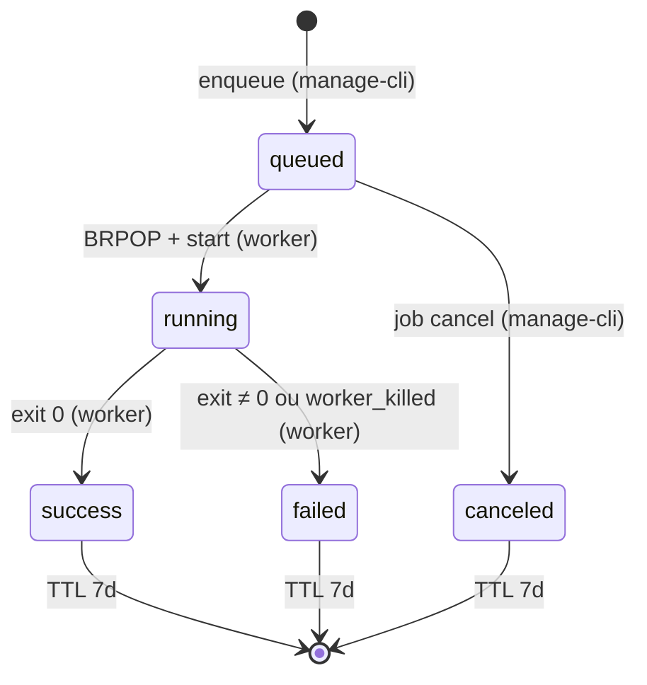
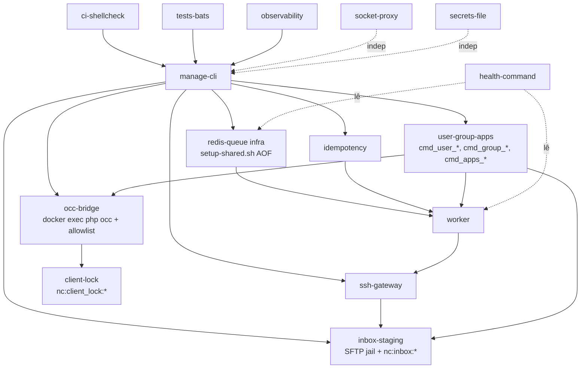

# Contratos Formais — Nextcloud SaaS Manager v12.0

> **Documento gerado por** `/arquiteto contratos` (skill `analista-sistema`, Fase 5).
> **Fonte da verdade** de tudo que cruza a fronteira entre o servidor e a **API REST consumidora** (que vive em outro repositório). Mudanças aqui são **breaking** e seguem a política de versionamento da Seção 2.
>
> **Pré-requisitos verificados:**
>
> - `docs/ARCHITECTURE.md` (Fase 3, aprovado em 2026-05-07) — referência canônica de ADRs e Apêndice A.
> - `docs/REQUIREMENTS.md` (Fase 2) — Feature N, D, M e §11 (pontos de integração).
> - Schema canônico de Redis em `ARCHITECTURE.md §8.3` (re-expresso aqui em formato JSON Schema).
>
> **Escopo:** este documento define contratos **formais e verificáveis**. Implementação fica para os Sprints S1–S4 (`/pmo plan`). **Nada aqui é código** — é especificação.

## Sumário

1. [Visão geral e convenções](#1-visão-geral-e-convenções)
2. [Política de versionamento (responde Dúvida #8)](#2-política-de-versionamento-responde-dúvida-8)
3. [Contrato CLI (`manage.sh` / `nextcloud-manage`)](#3-contrato-cli-managesh--nextcloud-manage)
4. [Contratos JSON dos payloads `--json`](#4-contratos-json-dos-payloads---json)
5. [Contrato Webhook Callback (OpenAPI 3.0.3)](#5-contrato-webhook-callback-openapi-303)
6. [Schema operacional Redis (substitui DBML)](#6-schema-operacional-redis-substitui-dbml)
7. [Mapa de dependências entre módulos](#7-mapa-de-dependências-entre-módulos)
8. [Matriz de conformidade (REQUIREMENTS → contrato)](#8-matriz-de-conformidade-requirements--contrato)
9. [Pendências contratuais (Dúvidas em aberto)](#9-pendências-contratuais-dúvidas-em-aberto)
10. [Tradução de vocabulários entre API REST e scripts](#10-tradução-de-vocabulários-entre-api-rest-e-scripts)

---

## 1. Visão geral e convenções

### 1.1 Por que este projeto não tem OpenAPI próprio

`nextcloud-saas-manager` é uma plataforma **operacional em Bash + Docker Compose**. Ela **não expõe** uma API HTTP. As fronteiras formais que precisam ser respeitadas pela API REST consumidora são **cinco**, e estão todas neste documento:

| Fronteira | Tipo de contrato | Direção | Seção |
|---|---|---|---|
| Invocação de comando via SSH (`nextcloud-manage <argv>`) | **CLI argv + exit codes** | API → Servidor | §3 |
| Saída estruturada de qualquer comando com `--json` | **JSON Schema** (canônicos + payloads de request `--payload-stdin` + `OccExecResult`) | Servidor → API (stdout do SSH); API → Servidor (stdin) | §4 |
| Notificação assíncrona de conclusão de job | **OpenAPI 3.0.3** (do endpoint que a API expõe) | Servidor → API (HTTPS) | §5 |
| Estado interno consultável (Redis) | **Schema NoSQL canônico** | Worker ↔ manage-cli | §6 |
| **Pre-staging de anexos binários** (Feature O.5) | **Convenção de path SFTP + JSON Schema `InboxMetadata`** | API → Servidor (SCP/SFTP) | §3.9 |

> **Porque OpenAPI mas não temos servidor HTTP?** O contrato OpenAPI da §5 descreve o endpoint **que a API consumidora deve expor** (e este projeto consome). A API consumidora pode usá-lo diretamente em Swagger UI, Stoplight ou geradores de código.

### 1.2 Convenções gerais

- **Idioma**: identificadores e códigos de erro em **inglês** (consumo programático). Mensagens humanas em **pt-BR** quando exibidas via stderr.
- **Datas**: ISO 8601 com sufixo `Z` (UTC). Exemplo: `2026-05-08T14:32:01Z`.
- **Caracteres permitidos** em identificadores `<cliente>`: `[a-z0-9-]{1,64}` (hífen permitido, underscore **não** — API REST consumidora normaliza `_→-` antes do SSH; ver §3.4 e §10).
- **UUIDs**: sempre **v4** (regex em §3.4); usados como `job_id`, `idempotency-key`.
- **Hashes**: SHA-256 hex lowercase (`args_hash`, `caller_key_id`).
- **Encoding**: UTF-8 em todos os artefatos (stdin, stdout, hash payload, callback body).
- **Formato JSON**: `--json` produz **uma única linha** (NDJSON-friendly), sem indentação. Pretty-print só na seção humana fora de `--json`.
- **Scrub de segredos**: campos sensíveis nunca aparecem em payloads de máquina (ver §3.5).

### 1.3 Cabeçalho universal de payload JSON

Todo payload de saída com `--json` inclui na **raiz**:

```json
{ "schema_version": "1", "...": "..." }
```

`schema_version` é a única convenção sobre a qual a API consumidora deve fazer parse defensivo. Bump dela (`"2"`) sinaliza mudança incompatível (Seção 2).

### 1.4 Glossário rápido

| Termo | Significado |
|---|---|
| **Job** | Execução assíncrona de um comando (`create`, `update`, `remove`, `backup`, `restore`, `stop`, `start`, `user-create`, `user-remove`, `user-modify`, `group-create`, `group-remove`, `group-modify`, `apps-enable`, `apps-disable`). Identificado por `job_id` UUID v4. |
| **State** | Estado de um job. Valores válidos: `queued`, `running`, `success`, `failed`, `canceled`. |
| **Idempotency-key** | UUID v4 fornecido pela API para deduplicar retries (ADR-005). |
| **Callback** | URL HTTPS da API consumidora; worker faz `POST` ao concluir (ADR-004). |
| **Shim** | `/usr/local/bin/ncsaas-api-shim`, gateway de validação SSH (ADR-003). |
| **Worker** | `nextcloud-saas-worker.service` (systemd); processa jobs sequencialmente (ADR-002). |
| **Staging-id** | UUID v4 que identifica um diretório de pre-staging em `/opt/nextcloud-customers/inbox/<staging-id>/` populado via SCP antes de invocar `create` ou `occ-exec theming:config` com anexos (Feature O.5). |
| **OCC** | `nextcloud-occ` (binário oficial do Nextcloud, `php occ` dentro do container `<cliente>-app`). Acessado via `nextcloud-manage <cliente> occ-exec <subcmd>` com allowlist em §3.10 (Feature P). |
| **OCC-allowlist** | Lista canônica e fechada de subcomandos OCC permitidos pelo shim — única em §3.10.1. CI bloqueia drift entre lista do contrato e implementação em `lib/occ_bridge.sh`. |
| **Namespace hierárquico** | Token-2 da CLI quando diferente do `<dom\|_>` legado: `user`, `group`, `apps`, `occ-exec`. Espelha as URLs REST da API consumidora (Feature O e P). |
| **Client-lock** | Lock por cliente em `nc:client_lock:<cliente>` (Redis), pegado pelo worker (job que altera estado) e por `manage-cli` (`occ-exec` que altera estado). Coexiste com `nc:worker:lock` (que protege contra dois workers). |

---

## 2. Política de versionamento (responde Dúvida #8)

### 2.1 Estratégia de duas dimensões

Existem **dois eixos de versão** independentes e ambos devem ser respeitados pela API consumidora:

| Eixo | Onde aparece | Significado | Quem incrementa |
|---|---|---|---|
| **Versão do release** (`v12.0`, `v12.1`, …) | `README.md`, `git tag`, output de `manage.sh --version` | Versão do produto Nextcloud SaaS Manager. SemVer. | Time DevOps no release |
| **`schema_version`** (`"1"`, `"2"`, …) | Raiz de todo payload `--json` | Versão **estrutural** de cada payload `--json`. | Maintainer de contrato (este doc) |

> **Política**: a API REST consumidora **deve** verificar `schema_version` em todo parse. Se receber valor diferente do esperado → log + falha rápida (não tente acomodar versões futuras com fallback frágil).

### 2.2 O que conta como "breaking change"

Disparam **bump de `schema_version`** (e bump major do release):

- Remoção, renomeação ou mudança de tipo de qualquer campo **listado** em `required` ou produzido por padrão neste documento.
- **Remoção** ou renomeação de valores existentes de **enum** (`state`, `cmd`, `error`). Adição de novos valores **não** dispara bump (ver abaixo) — consumidores devem validar enum em modo "tolerante" (rejeitar valor desconhecido com falha rápida do **request**, não do **schema**).
- Mudança em **exit codes existentes** definidos em §3.6 com numeração `0–17`. Esta faixa é **imutável** durante toda v12.x.
- Mudança em **headers** do callback (HMAC scheme, header name).
- Adição de **flag obrigatória** ao CLI.

Disparam **apenas bump minor do release** (sem bump de `schema_version`):

- **Adição de novo valor a um enum** (e.g., novo `cmd`, novo `error`). Compatibilidade forward-compatible: consumidores que usam só os valores antigos continuam funcionando porque os novos valores **só aparecem** em respostas a invocações que usam features novas (a API legada nunca dispara `cmd=user-create` se ela não conhece `user create`).
- **Adição de novo campo opcional** ao payload (consumidor que ignora-o continua funcionando).
- **Adição de nova flag opcional** ao CLI.
- **Adição de novos exit codes** em qualquer numeração não-conflitante (preferindo faixa contígua acima do último). Exit codes 0–17 estão **reservados e imutáveis**; novos podem ocupar 18–49 e 50+.
- Adição de novos `event` types em logs (não no contrato).
- **Adição de novos namespaces hierárquicos no CLI** (ex.: `user`, `group`, `apps`, `occ-exec` em v12.0; potenciais `quota`, `share`, `ldap` no futuro). Compatível porque o parser distingue por token-2 (`<dom|_>` legado vs namespace novo).

> **Nota explícita sobre a expansão Feature O/P**: as adições documentadas no Histórico de Revisões em 2026-05-07 (revisão Feature O/P) são **forward-compatible** sob esta política — `schema_version` permanece "1". Consumidores que falam só do schema "1" original continuam recebendo respostas válidas para os comandos legados, e novos comandos só são acessíveis via novas formas de CLI que esses consumidores não conhecem.

### 2.3 Procedimento de mudança breaking

1. Abrir RFC em `docs/DECISION-BRIEF.md` referenciando este documento.
2. Bump `schema_version` neste arquivo + atualizar todos os 4 schemas afetados.
3. Atualizar `Histórico de Revisões` no fim deste arquivo.
4. **Período de coexistência opcional**: `manage.sh --schema-version=1 ...` permite consumir versão antiga por 1 release; default é a nova.
5. Remover suporte ao schema antigo no release seguinte ao período de coexistência.

### 2.4 Compromissos de estabilidade

| Garantia | Versão atual | Quando muda |
|---|---|---|
| `schema_version` permanece `"1"` durante todos os releases v12.x | `"1"` | v13+ apenas |
| Exit codes 0–17 são imutáveis | Sim | Nunca em v12.x |
| Argumentos posicionais legados (`<cliente> <dom\|_> <cmd>`) com 9 verbs originais são imutáveis em v12.x | Sim | v13+ pode reformular |
| Namespaces hierárquicos `user`, `group`, `apps`, `occ-exec` (Feature O/P) preservam semântica e flags em v12.x | Sim | Adição de namespaces novos OK; mudança de existentes em v13+ |
| HMAC = `sha256` em hex lowercase | Sim | Bump de `schema_version` |
| Allowlist OCC em §3.10.1 só **cresce** (nunca remove) durante v12.x | Sim | Remoção em v13+ |

---

## 3. Contrato CLI (`manage.sh` / `nextcloud-manage`)

> **Importante**: o binário pode ser invocado como `scripts/manage.sh` (operador local), `nextcloud-manage` (symlink em `/usr/local/bin/` instalado por `deploy-server.sh`) ou via `sudo nextcloud-manage` (modo da API através do shim — §3.7). Os três compartilham o mesmo argv.

### 3.1 Forma geral do comando

```text
nextcloud-manage <subject> <object> <verb> [global-flags...]
```

Onde:

| Token | Significado | Exemplos válidos |
|---|---|---|
| `<subject>` | Cliente (instância) ou palavra-chave operacional | `acme`, `cliente-xyz`, `list`, `health`, `worker`, `job` |
| `<object>` | Domínio do cliente, placeholder `_`, ou identificador secundário | `nextcloud.acme.com.br`, `_`, `<job-uuid>`, `<backup>.tar.gz` |
| `<verb>` | Ação | `create`, `status`, `update`, `remove`, `backup`, `restore`, `stop`, `start`, `credentials`, `cancel`, `logs` |

Quando `<subject>` é uma palavra-chave operacional (`list`, `health`, `worker`, `job`, `shared-status`), os tokens posicionais 2 e 3 mudam de papel — ver tabela §3.3.

### 3.2 Flags globais (todas opcionais, todas reconhecidas em qualquer comando exceto onde indicado)

| Flag | Tipo | Default | Comportamento | Aceita em |
|---|---|---|---|---|
| `--json` | bool | off | Saída estruturada NDJSON-friendly em stdout. Stderr fica para humano. | Todos |
| `--async` | bool | off | Enfileira o comando como job e retorna imediatamente; resposta é o schema `EnqueuedJob`. | Apenas verbs **async-allowed** (§3.5) |
| `--idempotency-key=<uuid-v4>` | string | — | Chave de deduplicação (ADR-005). Sem ela, retries criam jobs duplicados. | Apenas com `--async` |
| `--callback=<https-url>` | string | — | Worker faz `POST` ao concluir (§5). HTTPS obrigatório. | Apenas com `--async` |
| `--dry-run` | bool | off | Lista mudanças sem aplicá-las; quando combinado com `--async`, **não enfileira** (apenas descreve). | `create`, `update`, `remove`, todos os `user`/`group`/`apps` (Feature O) |
| `--confirm=<cliente>` | string | — | Obrigatório em `remove` síncrono (modo interativo); deve igualar `<subject>`. | `remove` (sync apenas) |
| `--schema-version=<N>` | string | `1` | Selecionar versão de payload (período de coexistência — §2.3). | Todos |
| `--no-color` | bool | off | Suprime cores ANSI no stderr humano. Implícito quando `--json` está ativo. | Todos |
| `--payload-stdin` | bool | off | Lê body JSON do stdin com campos extras (senhas, listas longas, atributos opcionais) — ver §3.9. **Obrigatório** quando há senha/secret. | Todos os verbs que aceitam senha ou payload estruturado |
| `--staging-id=<uuid-v4>` | string | — | Referencia diretório `/opt/nextcloud-customers/inbox/<staging-id>/` previamente populado via SCP (§3.9). Anexos (logo, background, app-bundle) são consumidos por valor de `<filename>` no payload. | `create`, `occ-exec branding`, todo verb que aceita anexos |
| `--strict` | bool | off | Em batch (`apps enable a,b,c`): falha do 1º item aborta os demais e marca job `failed`. Sem `--strict`: política tolerante (Feature O.4). | `apps enable`, `apps disable` |
| `--force` | bool | off | Override de safety check. Em `remove` cliente: permite remover mesmo com usuários ativos. Em `user remove`: ignora warning de shares pendentes. Em `group remove`: ignora warning de membros ativos (membros são "soltos", não deletados). **Não substitui `--confirm` no modo síncrono.** | `remove` (cliente, sync e async), `user remove`, `group remove` |
| `--backup-first` | bool | off | Apenas `remove` cliente: encadeia internamente um `backup` antes do `remove` (1 job composto, sequencial; `summary.backup` populado antes de `summary.remove`). Falha do backup aborta o remove. | `remove` (cliente) — sync e async |
| `--no-async-pickup` | bool | off | **Flag interna do worker** (não para a API): impede recursão. Rejeita se vier do shim (§3.7). | Internal |
| `--help`, `-h` | bool | — | Exibe usage e sai com exit 0. | Todos |
| `--version` | bool | — | Imprime `{"version":"v12.0.0","schema_version":"1"}` (com `--json`) ou `Nextcloud SaaS Manager v12.0.0` em texto. | Todos |

**Regra**: ordem das flags é livre, mas todas as flags **devem vir depois** dos três tokens posicionais (`<subject> <object> <verb>`). Parser proíbe `--async create acme ...`.

**Mutual exclusion**:

- `--json` + cores ANSI → `--no-color` é forçado em stdout (cores só vão para stderr humano).
- `--callback` sem `--async` → exit 5 com `{"error":"callback_requires_async"}`.
- `--idempotency-key` sem `--async` → exit 5 com `{"error":"idempotency_requires_async"}`.
- `--async` em verb não permitido (ex.: `status --async`, `occ-exec --async`) → exit 5 com `{"error":"async_not_supported","cmd":"<cmd>"}`.
- `--dry-run --async` em verb permitido → não enfileira; payload é `DryRunPlan` (não `EnqueuedJob`); exit 0.
- `--staging-id` sem o staging-id existir em `/opt/.../inbox/<id>/` → exit 11 com `{"error":"staging_id_not_found"}`.
- `--strict` em verb que não é batch (`apps enable`/`apps disable`) → exit 5 com `{"error":"strict_only_for_batch"}`.
- `--payload-stdin` ausente quando o verb exige senha/secret (`user create`, `user modify` com senha, `occ-exec user:add`, `occ-exec user:resetpassword`) → exit 5 com `{"error":"payload_stdin_required"}`.

### 3.3 Catálogo completo de comandos

#### 3.3.1 Comandos por cliente — formato legado de 3 posicionais (backward-compat)

| Forma | Verb | Síncrono / Assíncrono | Exit code esperado | Payload `--json` |
|---|---|---|---|---|
| `nextcloud-manage <cliente> <dominio> create` | create | **Async-only** (P0) | 0 (enqueue) ou 4 (state_conflict) | `EnqueuedJob` ou `DryRunPlan` |
| `nextcloud-manage <cliente> _ status` | status | Sync | 0, 2 (instance_not_found) | `ClientStatus` (§4.7) |
| `nextcloud-manage <cliente> _ credentials` | credentials | Sync | 0, 2, 13 (forbidden — sempre via shim) | `ClientCredentials` (§4.7) |
| `nextcloud-manage <cliente> _ backup` | backup | **Async-only** | 0 (enqueue) | `EnqueuedJob` |
| `nextcloud-manage <cliente> <arquivo.tar.gz> restore` | restore | **Async-only** | 0 (enqueue), 11 (file_not_found) | `EnqueuedJob` |
| `nextcloud-manage <cliente> _ update` | update | **Async-only** | 0 (enqueue) | `EnqueuedJob` ou `DryRunPlan` |
| `nextcloud-manage <cliente> _ stop` | stop | **Async-only** | 0 (enqueue) | `EnqueuedJob` |
| `nextcloud-manage <cliente> _ start` | start | **Async-only** | 0 (enqueue) | `EnqueuedJob` |
| `nextcloud-manage <cliente> _ remove [--force] [--backup-first]` | remove | **Async-only** se `--async`; sync exige `--confirm` | 0 (sync sucesso ou enqueue), 6 (confirm_missing) | `EnqueuedJob` ou `DryRunPlan` |

**Verbs async-allowed legados** (lista em `lib/validators.sh::ASYNC_ALLOWED_LEGACY`): `create`, `update`, `remove`, `backup`, `restore`, `stop`, `start`.

**Sobre `remove` estendido** (Feature O.1 + revisão de layout 2026-05-07):

```text
nextcloud-manage <cliente> _ remove --async [--force] [--backup-first] \
  --idempotency-key=<uuid> --callback=https://api.exemplo/jobs/hook
```

- `--force` — permite remover mesmo com usuários ativos (decisão da API quando o operador final confirma override).
- `--backup-first` — encadeia internamente `backup` antes do `remove`. **Operação composta**: 1 job no Redis com 2 fases internas (`summary.phases:[{name:"backup",...},{name:"remove",...}]`). Se o backup falha, o remove **não** executa e o job termina `failed` (exit 16). Útil quando a API consumidora oferece "Remove with backup" via `DELETE /customers/{customer} {force: true, backup: true}` do OpenAPI.

**Sobre `create` estendido** (Feature O.1): aceita 3 flags adicionais no formato legado preservando backward-compat:

```text
nextcloud-manage <cliente> <fqdn> create --async --json \
  --apps=files_pdfviewer,calendar,contacts \
  --full-apps \
  --staging-id=550e8400-e29b-41d4-a716-446655440000 \
  --idempotency-key=<uuid> \
  --callback=https://api.exemplo/jobs/hook
```

- `--apps=<csv>` — lista de IDs de apps a habilitar pós-criação (mapeia para `occ app:enable` interno por app).
- `--full-apps` — instala suite oficial de produtividade (`calendar, contacts, deck, mail, notes, tasks, files_pdfviewer`); mutuamente exclusivo com `--apps=` (escolha um).
- `--staging-id=<uuid>` — referencia anexos pré-staged via SCP em `/opt/nextcloud-customers/inbox/<uuid>/` (§3.9). Convenção de nomes: `logo.png`/`logo.jpg` → branding logo; `background.png`/`background.jpg` → branding background. Outros nomes ignorados na v12.0.

#### 3.3.2 Comandos operacionais (sem cliente)

| Forma | Função | Síncrono / Assíncrono | Payload `--json` |
|---|---|---|---|
| `nextcloud-manage list` | Lista instâncias | Sync | `ClientList` (§4.7) |
| `nextcloud-manage shared-status` | Status dos containers compartilhados | Sync | `SharedStatus` (§4.7) |
| `nextcloud-manage health` | Health check consolidado (8 checks paralelos) | Sync | **`Health`** (§4.4) |
| `nextcloud-manage worker status` | Estado do worker e fila | Sync | **`WorkerStatus`** (§4.3) |
| `nextcloud-manage worker stats [--by-cmd] [--by-client]` | Counts agregados por estado (Q-3) | Sync | **`QueueStats`** (§4.7.1) |
| `nextcloud-manage upgrade-harp <cliente>` | Migra HaRP do cliente para socket-proxy (Sprint 3) | Sync | `OperationResult` (§4.7) |

#### 3.3.3 Comandos de gerenciamento de jobs

| Forma | Função | Síncrono / Assíncrono | Payload `--json` |
|---|---|---|---|
| `nextcloud-manage job <job-id> status` | Estado completo do job | Sync | **`JobStatus`** (§4.2) |
| `nextcloud-manage job <job-id> logs` | Stream do log do job | Sync (texto) | — (`--json` retorna `JobLogs` com array de linhas) |
| `nextcloud-manage job <job-id> cancel` | Cancela job em fila (`queued` apenas) | Sync | `JobCancelResult` (§4.7) |
| `nextcloud-manage job list [--state=<state>] [--cmd=<cmd>] [--client=<cliente>] [--limit=N] [--offset=N \| --after=<job_id>]` | Lista jobs com filtros e paginação (Q-1..Q-4) | Sync | `JobList` (§4.7) |
| `nextcloud-manage worker stats [--json]` | Counts agregados por estado (espelha `GET /queue/stats` da API REST) | Sync | `QueueStats` (§4.7.1) |

> **Edge case**: `job <id> cancel` em job já `running` retorna exit 7 com `{"error":"job_not_cancelable","current_state":"running"}`. Não há kill forçado em v12.0 (registrado para v12.1+).

#### 3.3.4 Comandos hierárquicos REST-like — Feature O (lifecycle de user/group/apps)

> Forma `<cliente> <namespace> <action> [<positional>] [--flags...]` — espelha as URLs da API consumidora. Mantém backward-compat: parser distingue por checar se o token 2 está em `{user, group, apps, occ-exec}` (namespaces reservados) ou se é o `<dom|_>` legado.

##### 3.3.4.1 Namespace `user`

| Forma | Verb | Sync/Async | Payload `--json` (resposta) | Endpoint REST equivalente |
|---|---|---|---|---|
| `nextcloud-manage <cliente> user create <username> [--display-name=...] [--email=...] [--groups=g1,g2] [--quota=5GB] [--payload-stdin] --async` | user-create | **Async-only** | `EnqueuedJob` (cmd=`user-create`) | `POST /customers/{customer}/users` |
| `nextcloud-manage <cliente> user remove <username> [--force] --async` | user-remove | **Async-only** | `EnqueuedJob` (cmd=`user-remove`) | `DELETE /customers/{customer}/users/{username}` |
| `nextcloud-manage <cliente> user modify <username> [--display-name=...] [--email=...] [--add-groups=...] [--remove-groups=...] [--quota=...] [--payload-stdin] --async` | user-modify | **Async-only** | `EnqueuedJob` (cmd=`user-modify`) | `PATCH /customers/{customer}/users/{username}` |

**Validações (§3.4 estendido)**:

- `<username>`: regex `^[a-zA-Z0-9_.\-@]{1,64}$` (mais permissivo que `<cliente>` por compatibilidade com Nextcloud).
- `<groups>` (csv): cada item regex `^[a-zA-Z0-9_.\- ]{1,64}$`.
- `<quota>`: regex `^([0-9]+(\.[0-9]+)?\s?(B|KB|MB|GB|TB)|unlimited|none|default)$` (case-insensitive). Aceita formato Nextcloud nativo.

**Senha em `user create`/`user modify`**: **proibido** via flag `--password=`; deve vir no body de `--payload-stdin` (§3.9). Tentativa de passar via flag → exit 5 (`password_in_argv_forbidden`).

##### 3.3.4.2 Namespace `group`

| Forma | Verb | Sync/Async | Payload `--json` | Endpoint REST equivalente |
|---|---|---|---|---|
| `nextcloud-manage <cliente> group create <groupname> [--display-name=...] --async` | group-create | **Async-only** | `EnqueuedJob` (cmd=`group-create`) | `POST /customers/{customer}/groups` |
| `nextcloud-manage <cliente> group remove <groupname> [--force] --async` | group-remove | **Async-only** | `EnqueuedJob` (cmd=`group-remove`) | `DELETE /customers/{customer}/groups/{group}` |
| `nextcloud-manage <cliente> group modify <groupname> [--display-name=...] --async` | group-modify | **Async-only** | `EnqueuedJob` (cmd=`group-modify`) | `PATCH /customers/{customer}/groups/{group}` |

**Validações**: `<groupname>` segue mesmo regex que `<groups>` no namespace user.

##### 3.3.4.3 Namespace `apps`

| Forma | Verb | Sync/Async | Payload `--json` | Endpoint REST equivalente |
|---|---|---|---|---|
| `nextcloud-manage <cliente> apps enable <appid1>,<appid2>,... [--strict] --async` | apps-enable | **Async-only** | `EnqueuedJob` (cmd=`apps-enable`) | `POST /customers/{customer}/apps/enable` |
| `nextcloud-manage <cliente> apps disable <appid1>,<appid2>,... [--strict] --async` | apps-disable | **Async-only** | `EnqueuedJob` (cmd=`apps-disable`) | `POST /customers/{customer}/apps/disable` |

**Validações**: `<appid>`: regex `^[a-z0-9_]{1,64}$` (convenção Nextcloud — minúsculas, underscore, sem hífen).

**Política de tolerância** (Feature O.4):

- Default (sem `--strict`): falhas individuais não abortam o job; `summary.apps[]` contém `{appid, action, exit_code, message}` por item; `state=success` se >50% sucessos, `state=failed` se >50% falhas, exit 1 (warning) se houve mistura.
- Com `--strict`: 1ª falha aborta o restante; `state=failed`; demais apps em `summary.apps[]` ficam com `action=skipped`.

#### 3.3.5 Namespace `occ-exec` — Feature P (OCC sync passthrough)

> Único comando: `<cliente> occ-exec <occ-subcommand> [<args>...]`. Sempre sync. Allowlist de subcommands em §3.10.

```text
nextcloud-manage <cliente> occ-exec <subcmd> [<args>...] [--json] [--payload-stdin] [--staging-id=<uuid>]
```

| Forma exemplo | Endpoint REST equivalente | Payload `--json` |
|---|---|---|
| `<cliente> occ-exec user:add john --display-name="John" --payload-stdin` | `POST /occ/users` | `OccExecResult` (§4.9) |
| `<cliente> occ-exec user:setting john files quota "5 GB"` | `PATCH /occ/users/{u}` (quota) | `OccExecResult` |
| `<cliente> occ-exec user:delete john` | `DELETE /occ/users/{u}` | `OccExecResult` |
| `<cliente> occ-exec group:add editors` | `POST /occ/groups` | `OccExecResult` |
| `<cliente> occ-exec app:enable calendar` | `POST /occ/apps/{appId}/enable` | `OccExecResult` |
| `<cliente> occ-exec files:scan --all` | `POST /occ/files/rescan` | `OccExecResult` |
| `<cliente> occ-exec maintenance:mode --on` | `POST /occ/maintenance` | `OccExecResult` |
| `<cliente> occ-exec config:app:get files default_quota` | `GET /occ/quota/default` | `OccExecResult` (com `parsed_result`) |
| `<cliente> occ-exec config:app:set files default_quota --value "10 GB"` | `POST /occ/quota/default` | `OccExecResult` |
| `<cliente> occ-exec theming:config name "ACME Cloud" --staging-id=<uuid>` | `POST /occ/branding` | `OccExecResult` (multi-step interno) |
| `<cliente> occ-exec user:info john` | `GET /occ/users/{u}/quota` | `OccExecResult` (com `parsed_result`) |

**Restrições críticas** (Feature P):

- `--async` → sempre exit 5 (`async_not_supported`). OCC é síncrono por design.
- `--idempotency-key` → exit 5 (`idempotency_requires_async`). OCC subjacente é idempotente por allowlist.
- `--callback` → exit 5 (`callback_requires_async`).
- Cliente em job async `running` → exit 17 (`client_busy_async_job_running`). Aguardar ou cancelar o job antes.
- Container `<cliente>-app` parado → exit 14 (`instance_not_running`).
- OCC subcommand fora da allowlist (§3.10) → exit 100 (`occ_command_not_allowed`) **no shim**, antes de qualquer execução.
- Timeout > `WORKER_OCC_TIMEOUT_SEC` (default 60s) → exit 15 (`occ_timeout`); processo OCC recebe `SIGTERM` + `SIGKILL` após 5s extra; `OccExecResult.stdout` preservado até o ponto do kill.
- OCC retorna não-zero → exit 16 (`occ_command_failed`); stdout/stderr preservados.

### 3.4 Validações por flag (regex e reglas)

Todas validações ficam em `scripts/lib/validators.sh` e são chamadas **antes** de qualquer side-effect.

| Validador | Regex / regra | Erro se inválido |
|---|---|---|
| `is_valid_client_name` | `^[a-z0-9-]{1,64}$` (não começa nem termina com `-`) | exit 10, `invalid_client_name` |
| `is_valid_fqdn` | `^([a-z0-9]([a-z0-9-]{0,61}[a-z0-9])?\.)+[a-z]{2,63}$` (max 253 chars) | exit 10, `invalid_fqdn` |
| `is_valid_uuid_v4` | `^[0-9a-f]{8}-[0-9a-f]{4}-4[0-9a-f]{3}-[89ab][0-9a-f]{3}-[0-9a-f]{12}$` | exit 10, `invalid_uuid` |
| `is_valid_https_url` | `^https://[a-zA-Z0-9.\-_]+(:[0-9]{1,5})?(/[^\s]*)?$` | exit 10, `invalid_callback_url` |
| `is_valid_backup_filename` | `^[a-zA-Z0-9._-]+\.tar\.gz$` (max 255 chars) | exit 10, `invalid_backup_filename` |
| `is_valid_state_filter` | `state ∈ {queued,running,success,failed,canceled}` | exit 10, `invalid_state_filter` |
| `is_valid_username` (Feature O.2) | `^[a-zA-Z0-9_.\-@]{1,64}$` | exit 10, `invalid_username` |
| `is_valid_groupname` (Feature O.3) | `^[a-zA-Z0-9_.\- ]{1,64}$` | exit 10, `invalid_groupname` |
| `is_valid_appid` (Feature O.4) | `^[a-z0-9_]{1,64}$` (convenção Nextcloud — minúsculas/underscore) | exit 10, `invalid_appid` |
| `is_valid_quota` | `^([0-9]+(\.[0-9]+)?\s?(B\|KB\|MB\|GB\|TB)\|unlimited\|none\|default)$` (case-insensitive) | exit 10, `invalid_quota` |

**Sobre `--callback`** (Dúvida #1, REQUIREMENTS): default exige HTTPS público. Quando a Dúvida #1 for resolvida e a API for self-hosted no mesmo servidor, considerar relaxar para aceitar `http://localhost:NNNN` via flag de configuração no `WORKER_CALLBACK_ALLOW_LOCALHOST=1` (não em v12.0).

**Sobre o pattern do `<cliente>`** (decisão pós-revisão de layout 2026-05-07):

- O contrato dos scripts aceita **somente hífen** (`-`); underscore (`_`) é **rejeitado** com `invalid_client_name`.
- A **API REST consumidora** (Nextcloud Deployer API) aceita slugs com underscore (`acme_corp`) na sua fronteira HTTP por convenção interna (nomes de tabelas/diretórios em sua infra).
- **Responsabilidade de tradução**: a API REST **deve normalizar** o slug **antes** de invocar o SSH, substituindo `_` por `-` (e truncando em 64 chars). Exemplo: `acme_corp_subdivision` → `acme-corp-subdivision`. Esta normalização é **idempotente** e **bidirecional** (a API mantém um mapping `original_slug ↔ normalized_slug` em sua tabela `customers` para consultas reversas).
- Limite **64 chars** (era 32 em revisão anterior) acomoda slugs descritivos como `cliente-grande-com-nome-extenso-v2`.
- Detalhe completo da tradução vive em **§10** (Tradução de vocabulários entre API REST e scripts).

### 3.5 Operações async-allowed × sync-only (matriz definitiva)

| Comando | Sync? | Async? | Justificativa |
|---|---|---|---|
| `create` | ❌ | ✅ | Demora 5–15min — viola NFR de latência se sync |
| `status` | ✅ | ❌ | Read-only sub-1s; async é overhead inútil |
| `credentials` | ✅ | ❌ | Read-only; **só** acessível via shell local (não pelo shim — §3.7) |
| `backup` | ❌ | ✅ | Demora 2–10min |
| `restore` | ❌ | ✅ | Demora 5–15min |
| `update` | ❌ | ✅ | Demora 3–8min; pode reiniciar containers |
| `stop` | ❌ | ✅ | Demora 30s–2min; serializa para evitar race com outros comandos |
| `start` | ❌ | ✅ | Idem stop |
| `remove` | ✅ (com `--confirm`) | ✅ | Sync requer dupla confirmação (fat-finger guard) |
| `list` | ✅ | ❌ | Read-only |
| `health` | ✅ | ❌ | 8 checks paralelos timeout 5s cada |
| `worker status` | ✅ | ❌ | Read-only no Redis |
| `job <id> *` | ✅ | ❌ | Read-only (status/logs/cancel) |
| `shared-status` | ✅ | ❌ | Read-only |
| `upgrade-harp` | ✅ | ❌ | Operação rápida (regenerar compose + `docker compose up -d`) |
| `user create` (Feature O.2) | ❌ | ✅ | Multi-step: `user:add` + atribuir grupos + setar quota + template inicial; pode disparar email |
| `user remove` (Feature O.2) | ❌ | ✅ | Demora variável (`occ user:delete` precisa cleanup de shares e files) |
| `user modify` (Feature O.2) | ❌ | ✅ | Pode envolver mudança de quota com rescan opcional |
| `group create` (Feature O.3) | ❌ | ✅ | Pode disparar populate de membros via template |
| `group remove` (Feature O.3) | ❌ | ✅ | Cleanup de associações |
| `group modify` (Feature O.3) | ❌ | ✅ | Idem |
| `apps enable` (Feature O.4) | ❌ | ✅ | Cada app pode rodar migrations longas |
| `apps disable` (Feature O.4) | ❌ | ✅ | Idem |
| `occ-exec <subcmd>` (Feature P) | ✅ | ❌ | Bound timeout 60s; allowlist garante operações curtas |

### 3.6 Tabela canônica de exit codes

> **Imutável durante toda a faixa de versão v12.x.** Mudanças exigem bump de `schema_version` (§2.2).

| Exit | Símbolo | Categoria | Significado |
|---|---|---|---|
| `0` | `SUCCESS` | OK | Sucesso (sync) ou enqueue bem-sucedido (async) |
| `1` | `WARNING` | Soft fail | Health = `warn`; ou sucesso com avisos não-críticos |
| `2` | `FAIL_OR_UNAVAIL` | Hard fail | Health = `fail`; queue indisponível; instância não encontrada |
| `3` | `IDEMPOTENCY_CONFLICT` | Validação | Mesma key, args diferentes (ADR-005) |
| `4` | `STATE_CONFLICT` | Validação | `create` em instância existente com args diferentes (Feature D) |
| `5` | `FLAG_CONFLICT` | Validação | Mutual exclusion (--callback sem --async, etc.) |
| `6` | `CONFIRM_MISSING` | Validação | `remove` sync sem `--confirm` ou com `--confirm` errado |
| `7` | `JOB_NOT_CANCELABLE` | Estado | Job em `running` não pode ser cancelado |
| `8` | `WORKER_NOT_AVAILABLE` | Operacional | Worker está down (apenas comandos que exigem worker imediato — não async em si) |
| `9` | `SCHEMA_VERSION_NOT_SUPPORTED` | Versão | `--schema-version=N` fora do período de coexistência |
| `10` | `VALIDATION_ERROR` | Validação | Formato inválido (regex falha em §3.4) |
| `11` | `FILE_NOT_FOUND` | Operacional | Arquivo de backup ausente em `restore` |
| `12` | `PERMISSION_ERROR` | Operacional | sudo/filesystem (geralmente bug de instalação) |
| `13` | `FORBIDDEN_VIA_API` | Segurança | Comando bloqueado pelo shim (`credentials` por exemplo) |
| `14` | `INSTANCE_NOT_RUNNING` | Operacional (Feature P) | Container `<cliente>-app` parado; `occ-exec` precisa de container ativo |
| `15` | `OCC_TIMEOUT` | Operacional (Feature P) | OCC excedeu `WORKER_OCC_TIMEOUT_SEC` (default 60s); processo morto com `SIGTERM`+`SIGKILL` |
| `16` | `OCC_COMMAND_FAILED` | Aplicação (Feature P) | OCC retornou exit ≠ 0 (stdout/stderr preservados em `OccExecResult`) |
| `17` | `CLIENT_BUSY_ASYNC_JOB_RUNNING` | Concorrência (Feature P) | Job async em `running` no mesmo cliente; `occ-exec` que altera estado bloqueado |
| `100` | `SHIM_INVALID_COMMAND` | Shim (§3.7) | Metacaractere ou comando não-allowlisted |
| `101` | `SHIM_BINARY_NOT_ALLOWED` | Shim | argv[0] ≠ `nextcloud-manage` |
| `102` | `SHIM_OCC_NOT_ALLOWED` | Shim (Feature P) | OCC subcommand fora da allowlist §3.10 |
| `103` | `SHIM_NAMESPACE_NOT_ALLOWED` | Shim (Feature O) | Namespace token diferente de `user`/`group`/`apps`/`occ-exec`/cliente válido |
| `104` | `SHIM_STAGING_PATH_VIOLATION` | Shim (Feature O.5) | SCP fora de `/opt/nextcloud-customers/inbox/<staging-id>/` ou para path com `..` |
| `>=50` | reservados | Reservados para extensão minor | Não usar |
| `>=128` | sinal | Convenção POSIX | `128 + N` quando worker é morto por sinal `N` |

### 3.7 Allowlist do shim SSH (`ncsaas-api-shim`)

> Referência: ADR-003 + Apêndice A.7 do `ARCHITECTURE.md`.

O shim opera como **gateway de validação** entre o sshd e o `nextcloud-manage`. Todo comando da API REST consumidora **deve** passar por este filtro.

**Regras de aceitação:**

1. `argv[0]` **deve** ser literal `nextcloud-manage` — qualquer outro binário → exit 101.
2. `$SSH_ORIGINAL_COMMAND` **não pode** conter os metacaracteres `;`, `|`, `&`, `$`, `` ` ``, `\` em **nenhuma** posição (mesmo dentro de aspas) → exit 100.
3. `argv[1]` (o `<subject>`) **deve** estar nesta allowlist:

   ```text
   list, health, worker, job, shared-status, upgrade-harp, <client-regex>
   ```

   Onde `<client-regex>` = `^[a-z0-9-]{1,64}$` (idêntico ao `is_valid_client_name`).

4. `argv[2]` (o `<object/namespace>`):
   - Quando `argv[1]` é palavra-chave (`worker`, `job`, etc.): aceitar conforme tabela §3.3.2/§3.3.3.
   - Quando `argv[1]` é cliente, `argv[2]` deve ser um dos:
     - `_` (placeholder do formato legado)
     - FQDN válido (regex §3.4) — apenas para `create`
     - Backup filename válido — apenas para `restore`
     - **Namespace REST-like** (Feature O/P): `user`, `group`, `apps`, `occ-exec`
     - Qualquer outro valor → exit 103 (`namespace_not_allowed`).

5. `argv[3]` (o `<verb>`) **deve** pertencer à allowlist baseada em `argv[2]`:

   - **Formato legado** (`argv[2]=<dom|_>`):

     ```text
     create, status, credentials, backup, restore, stop, start, update, remove
     ```

   - **Namespace `user`** (Feature O.2): `create, remove, modify`.
   - **Namespace `group`** (Feature O.3): `create, remove, modify`.
   - **Namespace `apps`** (Feature O.4): `enable, disable`.
   - **Namespace `occ-exec`** (Feature P): `argv[3]` é o **OCC subcommand**, validado contra a allowlist em §3.10. Fora da lista → exit 102 (`occ_command_not_allowed`).
   - Quando `argv[1]=job`: subset `status, logs, cancel, list`.
   - Quando `argv[1]=worker`: subset `status, stats`.

6. **Flags bloqueadas pelo shim** (mesmo se argv parecer válido):
   - `--no-async-pickup` → exit 101 (flag interna do worker).
   - Qualquer flag iniciando com `--shim-` (reservado para futuro) → exit 100.
   - `--password=*` em qualquer namespace `user` → exit 100 (`password_in_argv_forbidden`); senha **deve** vir via `--payload-stdin`.
   - `--password-from-env` (e variantes do OCC) em `occ-exec` → exit 100; senha **deve** vir via `--payload-stdin`.

7. **Verb `credentials` é bloqueado pelo shim** quando `argv[1]` é cliente e `argv[2]=_` (formato legado): exit 13 com `{"error":"credentials_via_api_forbidden","message":"credentials are operator-only; access the server interactively"}`. Justificativa: senhas Nextcloud admin **não** devem trafegar via SSH automatizado.

8. **OCC subcommand validation extra** (Feature P): quando `argv[2]=occ-exec`, o shim adicionalmente:
   - Verifica `argv[3]` contra a allowlist em §3.10 (lista fechada, versionada por `schema_version`).
   - Bloqueia explicitamente: `argv[3] ∈ {encryption:*, db:execute, db:convert-type, config:system:set, update:check, upgrade, security:certificates*, app:install <não-oficial>}` → exit 102.
   - Verifica que **nenhum argumento OCC** começa com `--password` (case-insensitive) → exit 100.

9. **Forma SFTP do staging** (Feature O.5): SFTP é separado do shim (sshd usa `internal-sftp` pelo `Match User` — ver §3.9). Tentativas de SCP via `command="..."` → bypass do shim, mas o `ChrootDirectory` mantém isolamento.

10. Qualquer ramo de fail acima emite log estruturado em journald **antes** de sair (tag `ncsaas-api-ssh`, level `auth.warning`). Exemplo (placeholders entre `< >` substituídos em runtime):

    ```text
    {"event":"reject","reason":"<motivo>","key_id":"<sha256>","client_ip":"<ip>","argv":[...]}
    ```

**Saída em sucesso**: shim faz `exec sudo -n /usr/local/bin/nextcloud-manage "$@"` — o exit code do `nextcloud-manage` é o exit code visto pela API. Não há reescrita.

### 3.8 Scrub obrigatório de campos sensíveis

Estes campos **nunca** podem aparecer em saídas `--json` nem em journald (são scrubed para `***` na origem, em `lib/output_json.sh`):

- `MYSQL_PASSWORD`, `MARIADB_PASSWORD`, `DB_PASSWORD`, `DB_ROOT_PASSWORD`
- `NEXTCLOUD_ADMIN_PASSWORD`
- `REDIS_PASSWORD`
- `SIGNALING_SECRET`, `SIGNALING_HASH_KEY`, `SIGNALING_BLOCK_KEY`, `SIGNALING_INTERNAL_SECRET`
- `RECORDING_SECRET`
- `TURN_SECRET`
- `COLLABORA_ADMIN_PASSWORD`
- `WORKER_CALLBACK_SECRET`
- **Senhas de usuário Nextcloud** (Feature O.2 / Feature P): qualquer field `password`, `new_password`, `old_password`, `confirm_password` em payloads JSON; qualquer arg do `occ-exec` que case com `--password` ou `password-from-env`.
- **Conteúdo binário pré-staged** (Feature O.5): logo/background/icones em `staging/<id>/*` **não** são scrubed (não são secrets), mas o **path** é registrado, nunca o conteúdo binário.
- Qualquer campo que termine em `_SECRET`, `_PASSWORD`, `_TOKEN`, `_KEY` (regex defensivo).

> **Exceção**: `cmd_credentials` (apenas via shell local, bloqueado pelo shim — §3.7) imprime senhas em stdout. Isso é um caso isolado documentado e **fora do contrato de API**.

### 3.9 Pré-staging de anexos via SCP (Feature O.5) — **com fallback inline**

> Necessário para `create` estendido (logo/background) e `occ-exec theming:config` (mesmo motivo). Resolve o problema de **passar bytes binários via SSH command line**.
>
> **Decisão de design (revisada 2026-05-07)**: o contrato dos scripts suporta **dois modos**:
>
> 1. **SCP staging** (`--staging-id=<uuid>`) — preferido para anexos > 256KB (binário) ou produção em volume.
> 2. **Inline base64 via `--payload-stdin`** — aceito para anexos ≤ 256KB (binário) cada e total ≤ 384KB combinado.
>
> A API REST escolhe baseado no tamanho dos anexos recebidos do cliente HTTP. Esta dualidade existe porque o `openapi.yaml` da Nextcloud Deployer API expõe `logo_png_base64`/`background_png_base64` como `data:image/png;base64,...` no body JSON (camada HTTP), e o caminho mais simples para anexos pequenos é repassar via stdin sem precisar configurar SFTP.

#### 3.9.0 Decision matrix (qual modo usar)

| Tamanho do anexo (binário) | Modo recomendado | Motivo |
|---|---|---|
| ≤ 256 KB cada, ≤ 384 KB total | **Inline base64 via `--payload-stdin`** | Sem dependência de SFTP; 1 SSH session ao invés de 2 (scp + ssh) |
| > 256 KB cada, ou > 384 KB total | **SCP staging via `--staging-id`** | Evita estourar limites de stdin (64KB hard cap em §4.8.1 — neste contexto, body do stdin não inclui base64 inline; ver nota 3.9.0.1) |
| Branding sem anexos (só nome/cor/slogan) | **Nenhum dos dois** — só body JSON normal via `--payload-stdin` | Texto puro sempre cabe |

> **Nota 3.9.0.1**: o limite de 64KB do §4.8.1 (`--payload-stdin`) é para body **sem anexos**. Quando o body contém `logo_data_url` e/ou `background_data_url`, o limite efetivo do stdin sobe para **512 KB total** (suficiente para 384KB binário base64-codificado + JSON wrapper). Acima disso, o validador rejeita com `payload_too_large` (exit 10) e orienta usar `--staging-id`.

> **Nota 3.9.0.2**: `--staging-id` e campos `*_data_url` no body são **mutuamente exclusivos** para a mesma família (logo OU `staging-id` com `logo.png`, mas não ambos). Tentativa híbrida → exit 5 (`attachment_source_conflict`).

#### 3.9.1 Workflow

```text
┌─────┐     1) ssh ncsaas-api@host echo $RANDOM_STAGING_ID  (gera UUID v4)
│ API │ ──────────────────────────────────────────────▶ ┌────────┐
│     │                                                 │ shim   │
│     │     2) scp logo.png ncsaas-api@host:           │        │
│     │        /opt/nextcloud-customers/inbox/         │ sshd   │
│     │        <staging-id>/logo.png                   │ (sftp  │
│     │ ──────────────────────────────────────────────▶│ jail)  │
│     │     3) scp background.jpg ...                  │        │
│     │ ──────────────────────────────────────────────▶│        │
│     │     4) ssh ncsaas-api@host \                   │        │
│     │        nextcloud-manage acme nextcloud.acme... │        │
│     │        create --async --staging-id=<uuid>      │        │
│     │ ──────────────────────────────────────────────▶│        │
└─────┘                                                 └────────┘
```

#### 3.9.2 Geração e validação de `staging-id`

- **Convenção**: a API gera localmente um UUID v4 (mesmo formato que `idempotency-key` — §3.4) e pode reutilizá-lo como `idempotency-key` se desejar (atalho elegante para correlacionar request → staging → job). Não há comando para "criar staging-id" no servidor — basta criar o diretório via SCP/SFTP.
- **Path canônico**: `/opt/nextcloud-customers/inbox/<staging-id>/<filename>` onde `<filename>` é validado pelo manage-cli no consumo (ver §3.9.4).
- **Lifecycle**:
  1. **Criação**: SFTP cria implicitamente quando o primeiro `scp` para o path acontece.
  2. **Consumo**: `manage-cli` em `cmd_create`/`occ_exec_branding` move arquivos do `inbox/<staging-id>/` para `/opt/nextcloud-customers/jobs/<job_id>/staging/` e marca `nc:inbox:<staging-id>` (Redis) com `consumed_at`.
  3. **GC**: `nextcloud-saas-jobs-gc.timer` (Apêndice A.3 do ARCHITECTURE.md) já faz `find /opt/nextcloud-customers/inbox -mtime +1 -delete` adicional na v12.0.

#### 3.9.3 Configuração de SFTP restrito (`/etc/ssh/sshd_config.d/50-ncsaas-api.conf` — extensão da Apêndice A.4)

```sshd_config
# Existente (Fase 3 — para SSH/comando)
Match User ncsaas-api
    AllowTcpForwarding no
    X11Forwarding no
    PermitTTY no
    PermitTunnel no
    AllowAgentForwarding no
    GatewayPorts no
    ForceCommand /usr/local/bin/ncsaas-api-shim
    MaxSessions 4
    MaxStartups 4:30:8
    LoginGraceTime 15s
    ClientAliveInterval 30
    ClientAliveCountMax 2

# NOVO em v12.0 (Feature O.5) — drop-in adicional para sftp jail
# /etc/ssh/sshd_config.d/51-ncsaas-api-sftp.conf
Match User ncsaas-api Group ncsaas-api Address *
    # ssh comum (com command="...") continua funcionando via Match acima
    # sftp NÃO aciona ForceCommand — sshd dispatch é por sub-system

Subsystem sftp internal-sftp -f AUTHPRIV -l INFO

Match User ncsaas-api LocalCommand sftp-server
    ChrootDirectory /opt/nextcloud-customers/inbox
    ForceCommand internal-sftp -d /
    AllowTcpForwarding no
    X11Forwarding no
    PermitTunnel no
```

> **Crítico**: o `ChrootDirectory` exige que `/opt/nextcloud-customers/inbox` seja **owned by root** com permissão `0755` e que cada subdiretório `<staging-id>/` seja owned by `ncsaas-api:ncsaas-api` com `0700`. `deploy-server.sh` v12.0 cria a estrutura.

#### 3.9.4 Validação no consumo

`manage-cli` (em `cmd_create` e `occ-exec theming:config`) valida ao consumir `--staging-id=<uuid>`:

| Validação | Erro se falhar |
|---|---|
| `<staging-id>` é UUID v4 válido (regex §3.4) | exit 10 (`invalid_uuid`) |
| Diretório `/opt/nextcloud-customers/inbox/<staging-id>/` existe e é diretório | exit 11 (`staging_id_not_found`) |
| Cada arquivo no staging tem extensão na allowlist: `png`, `jpg`, `jpeg` (v12.0); futuras: `webp`, `svg` | exit 10 (`staging_invalid_filename`) |
| Cada arquivo tem nome canônico: `logo.{png,jpg,jpeg}`, `background.{png,jpg,jpeg}` | exit 10 (`staging_unknown_filename`) — outros nomes ignorados, mas avisados |
| Cada arquivo tem tamanho ≤ 5 MB | exit 10 (`staging_file_too_large`) |
| Tamanho total do staging ≤ 10 MB | exit 10 (`staging_total_too_large`) |
| Cada arquivo tem **magic bytes** consistentes com a extensão (PNG = `89 50 4E 47`, JPEG = `FF D8 FF`) | exit 10 (`staging_file_magic_mismatch`) |
| `nc:inbox:<staging-id>.consumed_at` ainda não foi setado (não consumir 2× a mesma staging) | exit 4 (`staging_already_consumed`) |

#### 3.9.5 Schema do `nc:inbox:<staging-id>` (Redis)

Adicional ao §6 (será integrado lá também):

```json
{
  "$id": "https://nextcloud-saas-manager.local/schemas/redis/InboxMetadata.json",
  "$schema": "https://json-schema.org/draft/2020-12/schema",
  "title": "InboxMetadata (Redis HASH at nc:inbox:<staging-id>)",
  "type": "object",
  "additionalProperties": false,
  "required": ["staging_id", "created_at", "uploaded_files"],
  "properties": {
    "staging_id":     { "type": "string", "pattern": "^[0-9a-f]{8}-[0-9a-f]{4}-4[0-9a-f]{3}-[89ab][0-9a-f]{3}-[0-9a-f]{12}$" },
    "created_at":     { "type": "string", "format": "date-time" },
    "uploaded_files": {
      "type": "array",
      "items": {
        "type": "object",
        "additionalProperties": false,
        "required": ["filename", "size_bytes", "sha256"],
        "properties": {
          "filename":   { "type": "string" },
          "size_bytes": { "type": "integer", "minimum": 0, "maximum": 5242880 },
          "sha256":     { "type": "string", "pattern": "^[0-9a-f]{64}$" }
        }
      },
      "maxItems": 8
    },
    "consumed_at":    { "type": ["string", "null"], "format": "date-time" },
    "consumed_by":    { "type": ["string", "null"], "description": "job_id que consumiu o staging" }
  }
}
```

> **Por que metadata em Redis em vez de só listar o filesystem?** Auditoria do "quem subiu o quê e quando" mesmo após o GC do diretório; impede consumo duplo do mesmo staging-id; permite que `manage.sh inbox list` (futuro v12.1+) sirva diagnóstico sem tocar disco.

> **Quem popula `nc:inbox:<staging-id>`?** Hook do sshd `internal-sftp` é limitado; a alternativa pragmática para v12.0 é o próprio `manage-cli` no início de `cmd_create`/`occ_exec_branding` fazer `find /opt/.../inbox/<staging-id>/ -type f` + `sha256sum` e popular o hash antes de consumir. Hook real fica registrado para v12.1+ se houver demanda.

### 3.10 Allowlist canônica de OCC subcommands (Feature P)

> Lista **fechada e versionada** — alteração exige PR + bump de `schema_version`. CI gera o filtro do shim a partir desta tabela (single source of truth).

#### 3.10.1 Subcommands permitidos (versão `1`)

| OCC subcommand | Endpoint REST que mapeia | `--output=json`? | Notas |
|---|---|---|---|
| `theming:config` | `POST /occ/branding` | ❌ (texto) | Multi-step internamente (name, color, slogan, logo, background); manage-cli orquestra |
| `user:add` | `POST /occ/users` | ❌ | Senha via `--payload-stdin` obrigatória; argv inclui `--display-name`, `--email`, `--group` |
| `user:delete` | `DELETE /occ/users/{u}` | ❌ | Idempotente |
| `user:disable` | (não mapeado em REST atual) | ❌ | Reservado |
| `user:enable` | (não mapeado em REST atual) | ❌ | Reservado |
| `user:info` | `GET /occ/users/{u}/quota` (filtrado) | ✅ (parsed_result) | Read-only |
| `user:list` | (interno — usado por `quota:audit`) | ✅ | Read-only |
| `user:setting` | `PATCH /occ/users/{u}` (quota e mais) | ❌ | argv `<user> <app> <key> "<value>"` |
| `user:resetpassword` | (não mapeado em REST atual) | ❌ | Senha via `--payload-stdin` obrigatória |
| `group:add` | `POST /occ/groups` | ❌ | Idempotente |
| `group:delete` | (não mapeado em REST atual) | ❌ | Reservado |
| `group:adduser` | (interno — usado por `user:add`) | ❌ | argv `<group> <user>` |
| `group:removeuser` | (interno) | ❌ | argv `<group> <user>` |
| `group:list` | (interno) | ✅ | Read-only |
| `group:info` | (interno) | ✅ | Read-only |
| `app:enable` | `POST /occ/apps/{appId}/enable` | ❌ | Single-app (vs Feature O.4 batch) |
| `app:disable` | (simétrico) | ❌ | Reservado |
| `app:list` | (operacional) | ✅ | Read-only |
| `app:install` | (apenas store oficial) | ❌ | Bloqueado se argv tem `--source` ou `--keep-disabled` |
| `app:remove` | (simétrico ao install) | ❌ | Reservado |
| `files:scan` | `POST /occ/files/rescan` | ❌ | argv `--all` ou `<user>`; grandes scans podem hit timeout 60s |
| `files:cleanup` | (operacional) | ❌ | Reservado |
| `files:repair-tree` | (operacional) | ❌ | Reservado |
| `maintenance:mode` | `POST /occ/maintenance` | ❌ | argv `--on`/`--off`/`--status` |
| `maintenance:repair` | (operacional, idempotente) | ❌ | Reservado |
| `config:app:get` | `GET /occ/quota/default`, `GET /occ/quota/options` | ✅ | argv `<appname> <key>` |
| `config:app:set` | `POST /occ/quota/default`, `POST /occ/quota/options` | ❌ | argv `<appname> <key> --value=...`; **bloqueado** se `<appname>=core` (proteger config global) |
| `config:app:delete` | (simétrico) | ❌ | argv `<appname> <key>`; bloqueado para `core` |
| `config:app:list` | (read-only) | ✅ | argv `<appname>` |
| `config:system:get` | (read-only) | ✅ | argv `<key>` |
| `db:add-missing-indices` | (operacional, idempotente) | ❌ | Sem args |
| `db:add-missing-columns` | (operacional, idempotente) | ❌ | Sem args |
| `notification:generate` | (não mapeado em REST atual) | ❌ | Reservado para v12.1+ |
| `versions:expire` | (operacional) | ❌ | argv `<user>` |
| `versions:cleanup` | (operacional) | ❌ | argv `<user>` |

#### 3.10.2 Subcommands explicitamente bloqueados (mesmo se aparecerem em allowlist futura)

Estes nunca atravessam o shim, mesmo via PR:

- `encryption:*` — `enable`, `disable`, `migrate`, `decrypt-all`, `change-key-storage-root`. **Risco de perda de dados.**
- `db:execute`, `db:convert-type`, `db:convert-mysql-charset` — operações estruturais.
- `app:install` quando argv contém `--source=http`, `--keep-disabled` ou caminho de filesystem (`/path/to/app`). **Apenas store oficial.**
- `config:system:set` — config global do Nextcloud (não por cliente). Operador local apenas.
- `update:check`, `upgrade` — parte do `cmd update` async com backup automático; não é OCC ad-hoc.
- `security:certificates*` — gestão de certificados; operador local apenas.

#### 3.10.3 Decisões adicionais sobre OCC

- **`--output=json`** é passado automaticamente pelo `manage-cli` quando o OCC subcommand suporta (lista hardcoded em `lib/occ_bridge.sh`). Quando não suporta, `OccExecResult.parsed_result=null` e `stdout` contém o texto cru.
- **Variáveis de ambiente injetadas no `docker exec`**: apenas `NC_PASS` (quando há senha em `--payload-stdin`) e `NC_LANG=en_US`. Nada de `PATH` customizado, nada de `NC_DEBUG`.
- **OCC argv quoting**: `docker exec <c>-app php occ <subcmd> "${args[@]}"` em modo array Bash 4+ — nunca `eval`, nunca `bash -c`.
- **Auditoria por invocação**: 1 linha NDJSON em journald (tag `nextcloud-saas-occ-exec`) com o formato canônico abaixo.

Formato canônico do evento `occ_exec` (placeholders `<...>` substituídos em runtime):

```text
{"event":"occ_exec","client":"<cliente>","occ_subcommand":"<subcmd>","args":[...],"caller_key_id":"sha256:<hash>","exit_code":<int>,"duration_ms":<int>,"started_at":"<iso>","finished_at":"<iso>"}
```

#### 3.10.4 Single source of truth para CI

A tabela §3.10.1 é parseável por script. CI roda em todo PR:

```bash
# .github/workflows/contracts-check.sh (v12.0)
# Extrai a allowlist canônica deste documento e compara com lib/occ_bridge.sh::OCC_ALLOWLIST
diff <(awk '/^\| `/{print $2}' docs/CONTRACTS.md | tr -d '`' | sort) \
     <(grep -oP "OCC_ALLOWLIST\+=\(['\"][^'\"]+" scripts/lib/occ_bridge.sh | awk -F"['\"]" '{print $2}' | sort)
```

> Drift = falha de CI. Mitiga R-O-1.

---

## 4. Contratos JSON dos payloads `--json`

> Quatro **schemas canônicos** mais o envelope de erro e schemas auxiliares (§4.7). Todos seguem JSON Schema Draft 2020-12. Todos têm `$id` próprio para extração futura para arquivos `docs/schemas/*.schema.json` se necessário (não obrigatório em v12.0 — premissa §1 do REQUIREMENTS, "soluções não-elaboradas").

### 4.1 `EnqueuedJob` — resposta de `--async`

**Quando**: comando async-allowed com `--async --json`, sem conflito de idempotência.

**Exemplo**:

```json
{
  "schema_version": "1",
  "job_id": "550e8400-e29b-41d4-a716-446655440000",
  "state": "queued",
  "cmd": "create",
  "client": "acme",
  "queued_at": "2026-05-08T14:32:01Z",
  "idempotency_key": "550e8400-e29b-41d4-a716-446655440000",
  "callback_url": "https://api.exemplo/jobs/hook",
  "log_path": "/opt/nextcloud-customers/jobs/550e8400-e29b-41d4-a716-446655440000.log"
}
```

**JSON Schema**:

```json
{
  "$id": "https://nextcloud-saas-manager.local/schemas/EnqueuedJob.json",
  "$schema": "https://json-schema.org/draft/2020-12/schema",
  "title": "EnqueuedJob",
  "type": "object",
  "additionalProperties": false,
  "required": ["schema_version", "job_id", "state", "cmd", "client", "queued_at", "log_path"],
  "properties": {
    "schema_version": { "const": "1" },
    "job_id":         { "type": "string", "pattern": "^[0-9a-f]{8}-[0-9a-f]{4}-4[0-9a-f]{3}-[89ab][0-9a-f]{3}-[0-9a-f]{12}$" },
    "state":          { "const": "queued" },
    "cmd":            { "enum": [
      "create", "update", "remove", "backup", "restore", "stop", "start",
      "user-create", "user-remove", "user-modify",
      "group-create", "group-remove", "group-modify",
      "apps-enable", "apps-disable"
    ] },
    "client":         { "type": "string", "pattern": "^[a-z0-9-]{1,64}$" },
    "target":         { "type": ["string", "null"], "description": "Para user-*: username; group-*: groupname; apps-*: csv de appids; create/update/remove/backup/restore/stop/start: null." },
    "queued_at":      { "type": "string", "format": "date-time" },
    "idempotency_key": { "type": ["string", "null"], "pattern": "^[0-9a-f]{8}-[0-9a-f]{4}-4[0-9a-f]{3}-[89ab][0-9a-f]{3}-[0-9a-f]{12}$" },
    "staging_id":     { "type": ["string", "null"], "pattern": "^[0-9a-f]{8}-[0-9a-f]{4}-4[0-9a-f]{3}-[89ab][0-9a-f]{3}-[0-9a-f]{12}$", "description": "Set quando --staging-id foi fornecido (Feature O.5)." },
    "callback_url":   { "type": ["string", "null"], "format": "uri", "pattern": "^https://" },
    "log_path":       { "type": "string", "pattern": "^/opt/nextcloud-customers/jobs/[0-9a-f-]+\\.log$" }
  }
}
```

**Caso especial — idempotency hit (mesma key + args)**: payload é o **mesmo** schema, mas `queued_at` reflete a primeira invocação (é o do job antigo); `state` pode ser `queued` ou qualquer estado posterior. Exit 0 sempre.

**Sobre `target`** (novo na expansão Feature O): o campo identifica o sub-recurso da operação dentro do cliente. Exemplos:

- `cmd=user-create`, `target="john"` → criar usuário `john` no cliente.
- `cmd=apps-enable`, `target="calendar,contacts,deck"` → habilitar 3 apps no cliente.
- `cmd=create`, `target=null` → criar o cliente em si.

A API consumidora deve usar `(cmd, client, target)` como chave de display no painel — não apenas `(cmd, client)`.

### 4.2 `JobStatus` — resposta de `manage.sh job <id> status`

**Quando**: API ou operador consulta estado do job. Read-only no Redis.

**Exemplo (running, cmd=create)**:

```json
{
  "schema_version": "1",
  "job_id": "550e8400-e29b-41d4-a716-446655440000",
  "state": "running",
  "cmd": "create",
  "client": "acme",
  "target": null,
  "staging_id": "11111111-2222-4333-8444-555555555555",
  "args": ["acme", "nextcloud.acme.com.br", "create", "--apps=calendar,contacts", "--staging-id=11111111-2222-4333-8444-555555555555"],
  "args_hash": "a1b2c3d4e5f60718293a4b5c6d7e8f90a1b2c3d4e5f60718293a4b5c6d7e8f90",
  "idempotency_key": "550e8400-e29b-41d4-a716-446655440000",
  "callback_url": "https://api.exemplo/jobs/hook",
  "queued_at": "2026-05-08T14:32:01Z",
  "started_at": "2026-05-08T14:32:03Z",
  "finished_at": null,
  "exit_code": null,
  "error_msg": null,
  "log_path": "/opt/nextcloud-customers/jobs/550e8400-e29b-41d4-a716-446655440000.log",
  "log_size_bytes": 4096,
  "summary": null,
  "callback": {
    "url": "https://api.exemplo/jobs/hook",
    "attempts": 0,
    "last_error": null,
    "last_status_code": null,
    "delivered_at": null,
    "failed_after_retries": false
  },
  "caller": {
    "key_id": "sha256:abc123...",
    "uid": "1003",
    "ip": "203.0.113.10"
  }
}
```

**Exemplo (success, cmd=user-create — Feature O.2)**:

```json
{
  "schema_version": "1",
  "job_id": "ab7d8c12-3456-4789-a012-3456789abcde",
  "state": "success",
  "cmd": "user-create",
  "client": "acme",
  "target": "john",
  "staging_id": null,
  "args": ["acme", "user", "create", "john", "--display-name=John Doe", "--email=john@acme.com", "--groups=editors", "--quota=5GB", "--payload-stdin"],
  "args_hash": "b2c3d4e5...",
  "idempotency_key": "660f9511-f30c-42e5-b827-557766551111",
  "callback_url": "https://api.exemplo/jobs/hook",
  "queued_at": "2026-05-08T15:00:00Z",
  "started_at": "2026-05-08T15:00:02Z",
  "finished_at": "2026-05-08T15:00:08Z",
  "exit_code": 0,
  "error_msg": null,
  "log_path": "/opt/nextcloud-customers/jobs/ab7d8c12-3456-4789-a012-3456789abcde.log",
  "log_size_bytes": 1234,
  "summary": {
    "username": "john",
    "display_name": "John Doe",
    "email": "john@acme.com",
    "groups": ["editors"],
    "quota_set": "5 GB",
    "occ_steps": [
      { "step": "user:add", "exit_code": 0, "duration_ms": 1820 },
      { "step": "group:adduser editors john", "exit_code": 0, "duration_ms": 410 },
      { "step": "user:setting john files quota '5 GB'", "exit_code": 0, "duration_ms": 320 }
    ]
  },
  "callback": {
    "url": "https://api.exemplo/jobs/hook",
    "attempts": 1,
    "last_error": null,
    "last_status_code": 200,
    "delivered_at": "2026-05-08T15:00:09Z",
    "failed_after_retries": false
  },
  "caller": {
    "key_id": "sha256:abc123...",
    "uid": "1003",
    "ip": "203.0.113.10"
  }
}
```

**Exemplo (success)** — `finished_at`, `exit_code` e `summary` preenchidos; `state="success"`. Recorte do campo `summary` para `cmd=create` (campos variam por verb; ver §4.7 e regra `additionalProperties: true` no schema):

```json
{
  "summary": {
    "client": "acme",
    "domain": "nextcloud.acme.com.br",
    "redis_dbindex": 5,
    "db_name": "nextcloud_acme",
    "containers_started": ["acme-app", "acme-cron", "acme-harp"],
    "duration_ms": 487231,
    "cert_status": "issued"
  }
}
```

**JSON Schema**:

```json
{
  "$id": "https://nextcloud-saas-manager.local/schemas/JobStatus.json",
  "$schema": "https://json-schema.org/draft/2020-12/schema",
  "title": "JobStatus",
  "type": "object",
  "additionalProperties": false,
  "required": [
    "schema_version", "job_id", "state", "cmd", "client", "args", "args_hash",
    "queued_at", "log_path", "callback", "caller"
  ],
  "properties": {
    "schema_version": { "const": "1" },
    "job_id":         { "type": "string", "pattern": "^[0-9a-f]{8}-[0-9a-f]{4}-4[0-9a-f]{3}-[89ab][0-9a-f]{3}-[0-9a-f]{12}$" },
    "state":          { "enum": ["queued", "running", "success", "failed", "canceled"] },
    "cmd":            { "enum": [
      "create", "update", "remove", "backup", "restore", "stop", "start",
      "user-create", "user-remove", "user-modify",
      "group-create", "group-remove", "group-modify",
      "apps-enable", "apps-disable"
    ] },
    "client":         { "type": "string", "pattern": "^[a-z0-9-]{1,64}$" },
    "target":         { "type": ["string", "null"], "description": "Sub-recurso (username/groupname/apps-csv); null para cmd cliente-level." },
    "staging_id":     { "type": ["string", "null"], "pattern": "^[0-9a-f]{8}-[0-9a-f]{4}-4[0-9a-f]{3}-[89ab][0-9a-f]{3}-[0-9a-f]{12}$" },
    "args":           { "type": "array", "items": { "type": "string" }, "minItems": 1 },
    "args_hash":      { "type": "string", "pattern": "^[0-9a-f]{64}$" },
    "idempotency_key": { "type": ["string", "null"], "pattern": "^[0-9a-f]{8}-[0-9a-f]{4}-4[0-9a-f]{3}-[89ab][0-9a-f]{3}-[0-9a-f]{12}$" },
    "callback_url":   { "type": ["string", "null"], "format": "uri" },
    "queued_at":      { "type": "string", "format": "date-time" },
    "started_at":     { "type": ["string", "null"], "format": "date-time" },
    "finished_at":    { "type": ["string", "null"], "format": "date-time" },
    "exit_code":      { "type": ["integer", "null"], "minimum": 0, "maximum": 255 },
    "error_msg":      { "type": ["string", "null"], "maxLength": 2048 },
    "log_path":       { "type": "string", "pattern": "^/opt/nextcloud-customers/jobs/[0-9a-f-]+\\.log$" },
    "log_size_bytes": { "type": "integer", "minimum": 0 },
    "summary":        { "type": ["object", "null"], "additionalProperties": true },
    "callback": {
      "type": "object",
      "additionalProperties": false,
      "required": ["attempts", "failed_after_retries"],
      "properties": {
        "url":                  { "type": ["string", "null"], "format": "uri" },
        "attempts":             { "type": "integer", "minimum": 0, "maximum": 3 },
        "last_error":           { "type": ["string", "null"], "maxLength": 512 },
        "last_status_code":     { "type": ["integer", "null"], "minimum": 100, "maximum": 599 },
        "delivered_at":         { "type": ["string", "null"], "format": "date-time" },
        "failed_after_retries": { "type": "boolean" }
      }
    },
    "caller": {
      "type": "object",
      "additionalProperties": false,
      "required": ["key_id", "uid"],
      "properties": {
        "key_id": { "type": "string", "pattern": "^sha256:[A-Za-z0-9+/=]+$" },
        "uid":    { "type": "string", "pattern": "^[0-9]+$" },
        "ip":     { "type": ["string", "null"] }
      }
    }
  },
  "allOf": [
    {
      "comment": "Quando state=success/failed/canceled, finished_at e exit_code são obrigatórios",
      "if":   { "properties": { "state": { "enum": ["success", "failed", "canceled"] } } },
      "then": { "required": ["finished_at", "exit_code"] }
    },
    {
      "comment": "Quando state=running ou superior, started_at é obrigatório",
      "if":   { "properties": { "state": { "enum": ["running", "success", "failed"] } } },
      "then": { "required": ["started_at"] }
    },
    {
      "comment": "Quando state=failed, error_msg é obrigatório",
      "if":   { "properties": { "state": { "const": "failed" } } },
      "then": { "required": ["error_msg"] }
    }
  ]
}
```

### 4.3 `WorkerStatus` — resposta de `manage.sh worker status`

**Exemplo**:

```json
{
  "schema_version": "1",
  "active": true,
  "concurrency": 1,
  "started_at": "2026-05-08T08:14:00Z",
  "uptime_seconds": 22321,
  "queue_depth": 2,
  "current_job": {
    "job_id": "550e8400-e29b-41d4-a716-446655440000",
    "cmd": "create",
    "client": "acme",
    "started_at": "2026-05-08T14:32:03Z"
  },
  "jobs_today": 17,
  "last_failure": {
    "job_id": "0c5b8c98-9b23-44e8-bf76-2d8e4c5b1234",
    "cmd": "update",
    "client": "beta",
    "finished_at": "2026-05-08T11:02:11Z",
    "error_msg": "timeout waiting for nextcloud upgrade"
  },
  "lock": {
    "host_flock_held": true,
    "redis_lock_held": true,
    "redis_lock_pid": "1289"
  }
}
```

**JSON Schema**:

```json
{
  "$id": "https://nextcloud-saas-manager.local/schemas/WorkerStatus.json",
  "$schema": "https://json-schema.org/draft/2020-12/schema",
  "title": "WorkerStatus",
  "type": "object",
  "additionalProperties": false,
  "required": ["schema_version", "active", "concurrency", "queue_depth", "jobs_today"],
  "properties": {
    "schema_version":  { "const": "1" },
    "active":          { "type": "boolean" },
    "concurrency":     { "type": "integer", "const": 1 },
    "started_at":      { "type": ["string", "null"], "format": "date-time" },
    "uptime_seconds":  { "type": ["integer", "null"], "minimum": 0 },
    "queue_depth":     { "type": "integer", "minimum": 0 },
    "current_job": {
      "type": ["object", "null"],
      "additionalProperties": false,
      "required": ["job_id", "cmd", "client", "started_at"],
      "properties": {
        "job_id":     { "type": "string", "pattern": "^[0-9a-f]{8}-[0-9a-f]{4}-4[0-9a-f]{3}-[89ab][0-9a-f]{3}-[0-9a-f]{12}$" },
        "cmd":        { "type": "string" },
        "client":     { "type": "string", "pattern": "^[a-z0-9-]{1,64}$" },
        "started_at": { "type": "string", "format": "date-time" }
      }
    },
    "jobs_today":      { "type": "integer", "minimum": 0 },
    "last_failure": {
      "type": ["object", "null"],
      "additionalProperties": false,
      "required": ["job_id", "cmd", "client", "finished_at"],
      "properties": {
        "job_id":      { "type": "string" },
        "cmd":         { "type": "string" },
        "client":      { "type": "string" },
        "finished_at": { "type": "string", "format": "date-time" },
        "error_msg":   { "type": ["string", "null"], "maxLength": 1024 }
      }
    },
    "lock": {
      "type": "object",
      "additionalProperties": false,
      "required": ["host_flock_held", "redis_lock_held"],
      "properties": {
        "host_flock_held": { "type": "boolean" },
        "redis_lock_held": { "type": "boolean" },
        "redis_lock_pid":  { "type": ["string", "null"], "pattern": "^[0-9]+$" }
      }
    }
  }
}
```

> **Nota sobre `active`**: `false` quando o systemd unit está em `inactive`/`failed`. Comando ainda assim retorna exit 0 — `--json` de `worker status` é sempre informativo. O monitoramento externo deve checar `active` e `queue_depth`, não o exit code.

### 4.4 `Health` — resposta de `manage.sh health`

**Exemplo (tudo ok)**:

```json
{
  "schema_version": "1",
  "checks": [
    { "name": "shared_containers", "status": "ok", "message": "8 containers running", "duration_ms": 312 },
    { "name": "traefik_certs", "status": "ok", "message": "all certs > 7 days remaining", "duration_ms": 1820 },
    { "name": "dns_fixed_domains", "status": "ok", "message": "collabora/signaling/turn resolve", "duration_ms": 421 },
    { "name": "recording_welcome", "status": "ok", "message": "recording HTTP 200", "duration_ms": 95 },
    { "name": "harp_socket_proxy", "status": "ok", "message": "all harp containers proxied", "duration_ms": 412 },
    { "name": "disk", "status": "ok", "message": "free 412G of 1.0T", "duration_ms": 28 },
    { "name": "redis_queue", "status": "ok", "message": "queue_depth=0 nc:jobs:* reachable", "duration_ms": 41 },
    { "name": "worker_active", "status": "ok", "message": "systemd active, no current job", "duration_ms": 22 }
  ],
  "summary": { "ok": 8, "warn": 0, "fail": 0 },
  "generated_at": "2026-05-08T14:35:00Z",
  "duration_ms": 1820
}
```

**JSON Schema**:

```json
{
  "$id": "https://nextcloud-saas-manager.local/schemas/Health.json",
  "$schema": "https://json-schema.org/draft/2020-12/schema",
  "title": "Health",
  "type": "object",
  "additionalProperties": false,
  "required": ["schema_version", "checks", "summary", "generated_at", "duration_ms"],
  "properties": {
    "schema_version": { "const": "1" },
    "checks": {
      "type": "array",
      "minItems": 8,
      "maxItems": 16,
      "items": {
        "type": "object",
        "additionalProperties": false,
        "required": ["name", "status", "message", "duration_ms"],
        "properties": {
          "name":        { "enum": [
            "shared_containers", "traefik_certs", "dns_fixed_domains",
            "recording_welcome", "harp_socket_proxy", "disk",
            "redis_queue", "worker_active"
          ] },
          "status":      { "enum": ["ok", "warn", "fail"] },
          "message":     { "type": "string", "maxLength": 512 },
          "duration_ms": { "type": "integer", "minimum": 0, "maximum": 5000 }
        }
      }
    },
    "summary": {
      "type": "object",
      "additionalProperties": false,
      "required": ["ok", "warn", "fail"],
      "properties": {
        "ok":   { "type": "integer", "minimum": 0 },
        "warn": { "type": "integer", "minimum": 0 },
        "fail": { "type": "integer", "minimum": 0 }
      }
    },
    "generated_at": { "type": "string", "format": "date-time" },
    "duration_ms":  { "type": "integer", "minimum": 0, "maximum": 10000 }
  }
}
```

> **Exit codes derivados do `summary`**: `fail > 0` → exit 2; `warn > 0` (sem fail) → exit 1; tudo `ok` → exit 0.

### 4.5 `ErrorEnvelope` — formato canônico de qualquer falha em `--json`

**Sempre emitido em stderr** (não stdout) — para a API conseguir distinguir `payload válido stdout` × `erro stderr` mesmo sem checar exit code. Em modo `--async`, falhas pré-enqueue **também** vão pelo stderr no envelope.

**Exemplo**:

```json
{
  "schema_version": "1",
  "error": "idempotency_conflict",
  "message": "idempotency-key already used with different args",
  "exit_code": 3,
  "details": {
    "existing_job_id": "550e8400-e29b-41d4-a716-446655440000",
    "existing_args_hash": "a1b2c3d4...",
    "incoming_args_hash": "f9e8d7c6..."
  },
  "retry_after_seconds": null,
  "generated_at": "2026-05-08T14:32:02Z"
}
```

**JSON Schema**:

```json
{
  "$id": "https://nextcloud-saas-manager.local/schemas/ErrorEnvelope.json",
  "$schema": "https://json-schema.org/draft/2020-12/schema",
  "title": "ErrorEnvelope",
  "type": "object",
  "additionalProperties": false,
  "required": ["schema_version", "error", "message", "exit_code", "generated_at"],
  "properties": {
    "schema_version": { "const": "1" },
    "error": {
      "enum": [
        "queue_unavailable", "idempotency_conflict", "state_conflict",
        "callback_requires_async", "idempotency_requires_async",
        "async_not_supported", "confirm_missing", "job_not_cancelable",
        "worker_not_available", "schema_version_not_supported",
        "validation_error", "invalid_client_name", "invalid_fqdn",
        "invalid_uuid", "invalid_callback_url", "invalid_backup_filename",
        "invalid_state_filter", "file_not_found", "permission_error",
        "credentials_via_api_forbidden", "instance_not_found",
        "invalid_command", "command_not_allowed"
      ]
    },
    "message":            { "type": "string", "maxLength": 1024 },
    "exit_code":          { "type": "integer", "minimum": 1, "maximum": 255 },
    "details":            { "type": ["object", "null"], "additionalProperties": true },
    "retry_after_seconds": { "type": ["integer", "null"], "minimum": 1 },
    "generated_at":       { "type": "string", "format": "date-time" }
  }
}
```

**Mapeamento `error` → `exit_code`** (canônico):

| `error` | `exit_code` |
|---|---|
| `queue_unavailable` | 2 |
| `idempotency_conflict` | 3 |
| `state_conflict` | 4 |
| `callback_requires_async`, `idempotency_requires_async`, `async_not_supported` | 5 |
| `confirm_missing` | 6 |
| `job_not_cancelable` | 7 |
| `worker_not_available` | 8 |
| `schema_version_not_supported` | 9 |
| `validation_error`, `invalid_*` | 10 |
| `file_not_found`, `instance_not_found` | 11 |
| `permission_error` | 12 |
| `credentials_via_api_forbidden` | 13 |
| `invalid_command`, `command_not_allowed` (do shim) | 100, 101 |

### 4.6 `DryRunPlan` — quando `--dry-run` é passado

**Exemplo**:

```json
{
  "schema_version": "1",
  "dry_run": true,
  "cmd": "create",
  "client": "acme",
  "domain": "nextcloud.acme.com.br",
  "would_apply": [
    { "resource": "mariadb_database", "action": "create", "name": "nextcloud_acme" },
    { "resource": "redis_dbindex", "action": "allocate", "value": 5 },
    { "resource": "filesystem_dir", "action": "create", "path": "/opt/nextcloud-customers/acme" },
    { "resource": "compose_file", "action": "render", "path": "/opt/nextcloud-customers/acme/docker-compose.yml" },
    { "resource": "containers", "action": "start", "names": ["acme-app", "acme-cron", "acme-harp"] },
    { "resource": "traefik_router", "action": "register", "host": "nextcloud.acme.com.br" },
    { "resource": "signaling_backend", "action": "append", "section": "[backend6]" },
    { "resource": "collabora_allowlist", "action": "append", "value": "nextcloud.acme.com.br" }
  ],
  "would_not_apply": [],
  "side_effects": false,
  "generated_at": "2026-05-08T14:32:01Z"
}
```

**Schema**: similar a `EnqueuedJob` mas com `dry_run: true` e arrays `would_apply`/`would_not_apply`. Schema completo omitido aqui por brevidade — embedded em `lib/output_json.sh`.

### 4.7 Schemas auxiliares (síncronos read-only)

Estes schemas são menos críticos (não cruzam fronteira segura) mas seguem a mesma convenção:

- **`ClientStatus`** (`status` por cliente): `{schema_version, client, exists, containers:[...], domain, ssl:{...}, redis_dbindex, db_name, healthcheck}`.
- **`ClientCredentials`** (`credentials`): bloqueado pelo shim (§3.7); apenas operador local — schema fora do contrato de API.
- **`ClientList`** (`list`): `{schema_version, clients:[{name, domain, created_at, state}], total}`.
- **`SharedStatus`** (`shared-status`): `{schema_version, services:[{name, container, state, image, uptime_seconds}]}`.
- **`OperationResult`** (`upgrade-harp`): `{schema_version, operation, target, before:{...}, after:{...}, applied_steps:[...], duration_ms}`.
- **`JobLogs`** (`job <id> logs --json`): `{schema_version, job_id, lines:[...], total_lines, truncated}`.
- **`JobCancelResult`** (`job <id> cancel`): `{schema_version, job_id, before_state, after_state}`.
- **`JobList`** (`job list`): `{schema_version, jobs:[{job_id, state, cmd, client, target, queued_at, finished_at}], total, filter:{state, cmd, client}, pagination:{limit, offset, next_after}}`.

#### 4.7.1 `QueueStats` (`worker stats`)

> Schema dedicado para counts agregados — espelha `GET /queue/stats` da API REST. Mantido separado do `WorkerStatus` (§4.3) que foca no estado do daemon.

```json
{
  "$id": "https://nextcloud-saas-manager.local/schemas/QueueStats.json",
  "$schema": "https://json-schema.org/draft/2020-12/schema",
  "title": "QueueStats",
  "type": "object",
  "additionalProperties": false,
  "required": ["schema_version", "queued", "running", "success", "failed", "canceled", "total", "computed_at"],
  "properties": {
    "schema_version": { "const": "1" },
    "queued":     { "type": "integer", "minimum": 0, "description": "Jobs em fila aguardando worker." },
    "running":    { "type": "integer", "minimum": 0, "description": "Jobs em execução (sempre 0 ou 1 com worker concurrency=1)." },
    "success":    { "type": "integer", "minimum": 0, "description": "Jobs concluídos com sucesso (janela retida = 7d via TTL Redis)." },
    "failed":     { "type": "integer", "minimum": 0, "description": "Jobs falhados (janela retida = 7d)." },
    "canceled":   { "type": "integer", "minimum": 0, "description": "Jobs cancelados (janela retida = 7d)." },
    "total":      { "type": "integer", "minimum": 0, "description": "Soma agregada (queued+running+success+failed+canceled)." },
    "by_cmd": {
      "type": ["object", "null"],
      "additionalProperties": { "type": "integer", "minimum": 0 },
      "description": "Breakdown por cmd; chaves são valores válidos do enum cmd em §4.1. Opcional — populado apenas com flag --by-cmd."
    },
    "by_client": {
      "type": ["object", "null"],
      "additionalProperties": { "type": "integer", "minimum": 0 },
      "description": "Breakdown por cliente; chaves são slugs. Opcional — populado apenas com flag --by-client."
    },
    "computed_at": { "type": "string", "format": "date-time", "description": "Timestamp de quando os counts foram calculados (Redis SCAN não é instantâneo)." }
  }
}
```

**Implementação interna**: counts em tempo real via `SCAN MATCH 'nc:jobs:*' COUNT 1000` + filtro por hash field `state`. Para escalar (>10K jobs persistidos), v12.1+ pode introduzir counters incrementais (`nc:metrics:by_state:<state>`).

**Mapeamento ao OpenAPI da API REST** (`GET /queue/stats`):

| Campo OpenAPI | Campo `QueueStats` | Tradução |
|---|---|---|
| `pending` | `queued` | 1:1 |
| `running` | `running` | 1:1 |
| `done` | `success` | 1:1 |
| `failed` | `failed` | 1:1 |
| `total` | `total` | 1:1 |
| (não exposto) | `canceled` | API REST pode somar em `failed` ou expor separadamente |
| (não exposto) | `by_cmd`, `by_client`, `computed_at` | Extensões; API REST escolhe se propaga |

> Esses schemas são **vivos** — podem ganhar campos opcionais sem breaking change (§2.2). Versão definitiva campo-a-campo será congelada no PR que implementa Sprint S1 (`/pmo plan`).

### 4.8 Request payloads — `--payload-stdin` (Feature O e P)

> Quando um verb requer atributos sensíveis (senha) ou estruturados (lista de groups, quota com formato custom), a API envia um body JSON via stdin. O `manage-cli` lê com `cat` em pipe e parseia com `jq`.

#### 4.8.1 Convenção geral

```text
ssh ncsaas-api@host nextcloud-manage acme user create john \
  --email=john@acme.com --groups=editors --quota=5GB \
  --payload-stdin --async --json --idempotency-key=<uuid> <<< '{
  "schema_version": "1",
  "password": "S3cr3t!Pa55"
}'
```

- `schema_version` é **obrigatório** em todo body de stdin (mesma política da §1.3).
- Body é **uma única linha** ou multi-linha (JSON normal); `manage-cli` faz `jq -c .` para normalizar antes de processar.
- Tamanho máximo: 64 KB (mais que suficiente para senhas e attributes; anexos binários vão por SCP staging — §3.9).
- **Mutual exclusion**: campos no body **não podem** repetir flags da CLI. Ex.: passar `--quota=5GB` E `body.quota="10GB"` → exit 5 (`payload_field_conflicts_flag`). Decisão: API escolhe **um** estilo por campo (recomendação: tudo via flags exceto password e listas longas).

#### 4.8.2 `UserCreatePayload`

```json
{
  "$id": "https://nextcloud-saas-manager.local/schemas/UserCreatePayload.json",
  "$schema": "https://json-schema.org/draft/2020-12/schema",
  "title": "UserCreatePayload",
  "type": "object",
  "additionalProperties": false,
  "required": ["schema_version", "password"],
  "properties": {
    "schema_version":   { "const": "1" },
    "password":         { "type": "string", "minLength": 8, "maxLength": 256 },
    "display_name":     { "type": ["string", "null"], "maxLength": 128 },
    "email":            { "type": ["string", "null"], "format": "email" },
    "groups":           { "type": "array", "items": { "type": "string", "pattern": "^[a-zA-Z0-9_.\\- ]{1,64}$" }, "maxItems": 64, "description": "Membership; mapeia para occ group:adduser <g> <user> em loop." },
    "subadmin_groups":  { "type": "array", "items": { "type": "string", "pattern": "^[a-zA-Z0-9_.\\- ]{1,64}$" }, "maxItems": 64, "description": "Grupos dos quais o usuário será SUBADMIN (subset de groups). Mapeia para occ user:setting <user> subadmin <group_id> via API interna do Nextcloud." },
    "quota":            { "type": ["string", "null"], "pattern": "^([0-9]+(\\.[0-9]+)?\\s?(B|KB|MB|GB|TB)|unlimited|none|default)$" }
  }
}
```

> Campos que aparecem **somente** via flag CLI: `--display-name`, `--email`, `--groups=`, `--quota=`. Body é necessário **apenas** para `password` e `subadmin_groups[]` (que não tem flag dedicada — sempre via stdin). Se você não precisa setar senha (raro — Nextcloud exige password no `user:add`), use `--password-from-system-default-via-stdin` (alternativa explícita) ou aceite valor gerado pelo Nextcloud.

> **Sobre `subadmin_groups`** (Feature O.2 estendida 2026-05-07): subadmin é uma flag por grupo, não global. Cada item DEVE também estar em `groups` (validador rejeita `subadmin sem membership` com exit 10 `subadmin_not_member`). Implementação interna pelo worker: para cada grupo em `subadmin_groups`, executar `occ group:adduser <g> <user>` (se ainda não membro) e depois marcar como subadmin via `occ user:setting <user> subadmin add <g>` (Nextcloud OCC ≥ 31).

#### 4.8.3 `UserModifyPayload`

```json
{
  "$id": "https://nextcloud-saas-manager.local/schemas/UserModifyPayload.json",
  "$schema": "https://json-schema.org/draft/2020-12/schema",
  "title": "UserModifyPayload",
  "type": "object",
  "additionalProperties": false,
  "required": ["schema_version"],
  "minProperties": 2,
  "properties": {
    "schema_version":     { "const": "1" },
    "password":           { "type": ["string", "null"], "minLength": 8, "maxLength": 256, "description": "Quando set, dispara user:resetpassword" },
    "display_name":       { "type": ["string", "null"], "maxLength": 128 },
    "email":              { "type": ["string", "null"], "format": "email" },
    "add_groups":         { "type": "array", "items": { "type": "string", "pattern": "^[a-zA-Z0-9_.\\- ]{1,64}$" }, "maxItems": 64 },
    "remove_groups":      { "type": "array", "items": { "type": "string", "pattern": "^[a-zA-Z0-9_.\\- ]{1,64}$" }, "maxItems": 64 },
    "add_subadmin":       { "type": "array", "items": { "type": "string", "pattern": "^[a-zA-Z0-9_.\\- ]{1,64}$" }, "maxItems": 64, "description": "Promove o usuário a subadmin nestes grupos (deve ser membro)." },
    "remove_subadmin":    { "type": "array", "items": { "type": "string", "pattern": "^[a-zA-Z0-9_.\\- ]{1,64}$" }, "maxItems": 64, "description": "Remove status de subadmin destes grupos." },
    "quota":              { "type": ["string", "null"], "pattern": "^([0-9]+(\\.[0-9]+)?\\s?(B|KB|MB|GB|TB)|unlimited|none|default)$" },
    "enable":             { "type": ["boolean", "null"], "description": "Reativa usuário desabilitado. Mapeia para occ user:enable. Mutuamente exclusivo com disable." },
    "disable":            { "type": ["boolean", "null"], "description": "Desabilita usuário (mantém dados). Mapeia para occ user:disable. Mutuamente exclusivo com enable." },
    "resend_welcome":     { "type": ["boolean", "null"], "description": "Reenvia o e-mail de boas-vindas. Requer Nextcloud com app `welcome` ou equivalente; mapeia para occ user:resend-welcome (se disponível) ou notification:generate." }
  },
  "allOf": [
    {
      "comment": "enable e disable são mutuamente exclusivos",
      "if":   { "anyOf": [{ "properties": { "enable": { "const": true } } }, { "properties": { "disable": { "const": true } } }] },
      "then": { "$comment": "Validado em runtime: enable=true e disable=true juntos -> exit 5 (mutually_exclusive_enable_disable)" }
    }
  ]
}
```

> `add_groups`/`remove_groups` e `add_subadmin`/`remove_subadmin` são deltas — mais expressivo que `groups: [...]` (substituição completa) que é difícil de implementar idempotentemente. `minProperties: 2` (schema_version + ao menos 1 outro campo) garante que um modify vazio é rejeitado em parse.

#### 4.8.4 `GroupCreatePayload`

```json
{
  "$id": "https://nextcloud-saas-manager.local/schemas/GroupCreatePayload.json",
  "$schema": "https://json-schema.org/draft/2020-12/schema",
  "title": "GroupCreatePayload",
  "type": "object",
  "additionalProperties": false,
  "required": ["schema_version"],
  "properties": {
    "schema_version": { "const": "1" },
    "display_name":   { "type": ["string", "null"], "maxLength": 128 }
  }
}
```

#### 4.8.4.1 `GroupModifyPayload`

```json
{
  "$id": "https://nextcloud-saas-manager.local/schemas/GroupModifyPayload.json",
  "$schema": "https://json-schema.org/draft/2020-12/schema",
  "title": "GroupModifyPayload",
  "type": "object",
  "additionalProperties": false,
  "required": ["schema_version"],
  "minProperties": 2,
  "properties": {
    "schema_version": { "const": "1" },
    "display_name":   { "type": ["string", "null"], "maxLength": 128, "description": "Atualiza display_name do grupo via occ group:info + edit (v12.0 best-effort se OCC suportar)." },
    "rename":         { "type": ["string", "null"], "pattern": "^[a-zA-Z0-9_.\\- ]{1,64}$", "description": "Novo nome (ID) do grupo. Implementação interna: occ group:rename quando disponível; senão ciclo group:add NEW + group:adduser (todos membros) NEW + group:delete OLD. Operação multi-step com riscos transacionais — ver §9.4 decisões diferidas." }
  }
}
```

> Para v12.0, `group create` aceita apenas `display_name` no body. `group modify` adiciona suporte a `rename` (descoberto na revisão de layout 2026-05-07; mapeia para `ModifyGroupRequest.rename` no OpenAPI da Nextcloud Deployer API). Estrutura ampliada (membros iniciais, descrição, quota de grupo) reservada para v12.1+.

#### 4.8.5 `AppsTogglePayload` (não-obrigatório; defaults sensatos)

```json
{
  "$id": "https://nextcloud-saas-manager.local/schemas/AppsTogglePayload.json",
  "$schema": "https://json-schema.org/draft/2020-12/schema",
  "title": "AppsTogglePayload",
  "type": "object",
  "additionalProperties": false,
  "required": ["schema_version"],
  "properties": {
    "schema_version": { "const": "1" },
    "apps":           { "type": "array", "items": { "type": "string", "pattern": "^[a-z0-9_]{1,64}$" }, "minItems": 1, "maxItems": 64 },
    "options":        {
      "type": "object",
      "additionalProperties": false,
      "properties": {
        "force":                 { "type": "boolean", "default": false, "description": "Aceita downgrade de versão (perigoso; padrão Nextcloud é proibir)" },
        "allow_unstable":        { "type": "boolean", "default": false, "description": "Permite apps marcadas como instáveis na store" },
        "keep_disabled_others":  { "type": "boolean", "default": true, "description": "Não desabilita apps que não estão na lista (default seguro)" },
        "remove_after_disable":  { "type": "boolean", "default": false, "description": "Apenas para apps disable: também desinstala (occ app:remove) o app após desabilitar. Mapeia para POST /apps/disable {remove: true} do OpenAPI." }
      }
    }
  }
}
```

> **Quando usar body vs flag**: `apps enable a,b,c` (CSV via positional argv) é o caminho default. Body com array `apps[]` é alternativa para listas grandes (>20 apps) ou quando precisa setar `options`.

#### 4.8.6 `CreateCustomerExtendedPayload` (Feature O.1)

> Estende o `cmd_create` legado com atributos da API REST que não cabem em flags simples. Body opcional — `cmd_create` continua funcionando sem body (igual v11.3.4).

```json
{
  "$id": "https://nextcloud-saas-manager.local/schemas/CreateCustomerExtendedPayload.json",
  "$schema": "https://json-schema.org/draft/2020-12/schema",
  "title": "CreateCustomerExtendedPayload",
  "type": "object",
  "additionalProperties": false,
  "required": ["schema_version"],
  "properties": {
    "schema_version": { "const": "1" },
    "admin": {
      "type": "object",
      "additionalProperties": false,
      "properties": {
        "username":     { "type": "string", "pattern": "^[a-zA-Z0-9_.\\-@]{1,64}$" },
        "password":     { "type": "string", "minLength": 12, "maxLength": 256, "description": "Quando ausente, manage-cli gera senha aleatória 24-char e a expõe via cmd_credentials" },
        "display_name": { "type": ["string", "null"] },
        "email":        { "type": ["string", "null"], "format": "email" }
      }
    },
    "apps":             { "type": "array", "items": { "type": "string", "pattern": "^[a-z0-9_]{1,64}$" }, "maxItems": 64 },
    "full_apps":        { "type": "boolean", "default": false },
    "branding": {
      "type": "object",
      "additionalProperties": false,
      "description": "Theming inicial. Logo/background podem chegar de duas formas (mutuamente exclusivas por arquivo): (a) referenciados por filename dentro do staging-id (Feature O.5 SCP) ou (b) inline data URL para arquivos pequenos.",
      "properties": {
        "instance_name": { "type": ["string", "null"], "maxLength": 64, "description": "Mapeia para occ theming:config name <value>." },
        "url":           { "type": ["string", "null"], "format": "uri", "description": "URL pública da instância (mostrada no rodapé). Mapeia para occ theming:config url <value>." },
        "slogan":        { "type": ["string", "null"], "maxLength": 128, "description": "Slogan/tagline. Mapeia para occ theming:config slogan <value>." },
        "color":         { "type": ["string", "null"], "pattern": "^#[0-9a-fA-F]{6}$", "description": "Cor primária hex (#RRGGBB). Mapeia para occ theming:config color <value>." },
        "logo_filename": { "type": ["string", "null"], "pattern": "^logo\\.(png|jpg|jpeg)$", "description": "Modo SCP: nome do arquivo dentro de /opt/.../inbox/<staging-id>/. Exige --staging-id na CLI." },
        "background_filename": { "type": ["string", "null"], "pattern": "^background\\.(png|jpg|jpeg)$", "description": "Modo SCP: análogo a logo_filename." },
        "logo_data_url": { "type": ["string", "null"], "pattern": "^data:image/(png|jpe?g);base64,[A-Za-z0-9+/=]+$", "description": "Modo inline: data URL base64. Tamanho do binário decodificado ≤ 256 KB (§3.9.0). Mutuamente exclusivo com logo_filename." },
        "background_data_url": { "type": ["string", "null"], "pattern": "^data:image/(png|jpe?g);base64,[A-Za-z0-9+/=]+$", "description": "Análogo a logo_data_url; ≤ 256 KB binário." }
      }
    }
  },
  "allOf": [
    {
      "comment": "apps e full_apps são mutuamente exclusivos",
      "if":   { "properties": { "full_apps": { "const": true } }, "required": ["full_apps"] },
      "then": { "not": { "required": ["apps"] } }
    },
    {
      "comment": "logo_filename e logo_data_url são mutuamente exclusivos (mesma família)",
      "if": { "properties": { "branding": { "required": ["logo_filename", "logo_data_url"] } } },
      "then": { "$comment": "Validado em runtime: exit 5 (attachment_source_conflict)" }
    },
    {
      "comment": "branding com *_filename exige staging_id na CLI",
      "if": {
        "properties": {
          "branding": {
            "anyOf": [
              { "required": ["logo_filename"] },
              { "required": ["background_filename"] }
            ]
          }
        }
      },
      "then": { "$comment": "Validado em runtime: --staging-id deve estar presente" }
    }
  ]
}
```

#### 4.8.7 `OccExecPayload` (Feature P)

> Body opcional para `occ-exec`. Necessário quando o OCC subcomando recebe senha (`user:add`, `user:resetpassword`) **ou** quando aplica branding com anexos inline (`theming:config` — ver §3.9).

```json
{
  "$id": "https://nextcloud-saas-manager.local/schemas/OccExecPayload.json",
  "$schema": "https://json-schema.org/draft/2020-12/schema",
  "title": "OccExecPayload",
  "type": "object",
  "additionalProperties": false,
  "required": ["schema_version"],
  "properties": {
    "schema_version": { "const": "1" },
    "password":       { "type": ["string", "null"], "minLength": 8, "maxLength": 256, "description": "Para user:add, user:resetpassword. Injetada via env NC_PASS no docker exec." },
    "branding": {
      "type": ["object", "null"],
      "additionalProperties": false,
      "description": "Apenas para occ-exec theming:config. Mesma estrutura de CreateCustomerExtendedPayload.branding (§4.8.6).",
      "properties": {
        "instance_name":      { "type": ["string", "null"], "maxLength": 64 },
        "url":                { "type": ["string", "null"], "format": "uri" },
        "slogan":             { "type": ["string", "null"], "maxLength": 128 },
        "color":              { "type": ["string", "null"], "pattern": "^#[0-9a-fA-F]{6}$" },
        "logo_filename":      { "type": ["string", "null"], "pattern": "^logo\\.(png|jpg|jpeg)$" },
        "background_filename":{ "type": ["string", "null"], "pattern": "^background\\.(png|jpg|jpeg)$" },
        "logo_data_url":      { "type": ["string", "null"], "pattern": "^data:image/(png|jpe?g);base64,[A-Za-z0-9+/=]+$" },
        "background_data_url":{ "type": ["string", "null"], "pattern": "^data:image/(png|jpe?g);base64,[A-Za-z0-9+/=]+$" }
      }
    },
    "extra_env":      { "type": ["object", "null"], "additionalProperties": { "type": "string", "maxLength": 1024 }, "description": "Reservado v12.1+; v12.0 ignora se presente." }
  }
}
```

### 4.9 `OccExecResult` — resposta de `occ-exec` (Feature P)

> Único schema de resposta para o passthrough OCC sync.

**Exemplo (`occ-exec maintenance:mode --on`)**:

```json
{
  "schema_version": "1",
  "client": "acme",
  "occ_command": "maintenance:mode",
  "occ_args": ["--on"],
  "exit_code": 0,
  "duration_ms": 1820,
  "stdout": "Maintenance mode enabled\n",
  "stderr": "",
  "parsed_result": null,
  "started_at": "2026-05-08T15:10:00Z",
  "finished_at": "2026-05-08T15:10:01Z",
  "container": {
    "id": "0c5b8c98",
    "name": "acme-app",
    "image": "nextcloud:31.0.4-fpm-alpine"
  },
  "caller": {
    "key_id": "sha256:abc123...",
    "uid": "1003",
    "ip": "203.0.113.10"
  }
}
```

**Exemplo (`occ-exec config:app:get files default_quota` — com parsed_result)**:

```json
{
  "schema_version": "1",
  "client": "acme",
  "occ_command": "config:app:get",
  "occ_args": ["files", "default_quota", "--output=json"],
  "exit_code": 0,
  "duration_ms": 320,
  "stdout": "\"5 GB\"",
  "stderr": "",
  "parsed_result": "5 GB",
  "started_at": "2026-05-08T15:11:00Z",
  "finished_at": "2026-05-08T15:11:00Z",
  "container": { "id": "0c5b8c98", "name": "acme-app", "image": "nextcloud:31.0.4-fpm-alpine" },
  "caller": { "key_id": "sha256:abc123...", "uid": "1003", "ip": "203.0.113.10" }
}
```

**JSON Schema**:

```json
{
  "$id": "https://nextcloud-saas-manager.local/schemas/OccExecResult.json",
  "$schema": "https://json-schema.org/draft/2020-12/schema",
  "title": "OccExecResult",
  "type": "object",
  "additionalProperties": false,
  "required": [
    "schema_version", "client", "occ_command", "occ_args", "exit_code",
    "duration_ms", "stdout", "stderr", "started_at", "finished_at", "caller"
  ],
  "properties": {
    "schema_version": { "const": "1" },
    "client":         { "type": "string", "pattern": "^[a-z0-9-]{1,64}$" },
    "occ_command":    { "type": "string", "description": "Subcommand executado (deve estar na allowlist §3.10)" },
    "occ_args":       { "type": "array", "items": { "type": "string", "maxLength": 512 }, "maxItems": 32 },
    "exit_code":      { "type": "integer", "minimum": 0, "maximum": 255 },
    "duration_ms":    { "type": "integer", "minimum": 0, "maximum": 60000 },
    "stdout":         { "type": "string", "maxLength": 65536, "description": "Truncado em 64KB; truncated_at_byte_count para sinalizar corte" },
    "stderr":         { "type": "string", "maxLength": 16384 },
    "stdout_truncated_at": { "type": ["integer", "null"], "minimum": 0 },
    "parsed_result":  { "description": "Quando OCC suporta --output=json e retornou JSON válido, contém o valor parseado. Senão, null." },
    "started_at":     { "type": "string", "format": "date-time" },
    "finished_at":    { "type": "string", "format": "date-time" },
    "container": {
      "type": ["object", "null"],
      "additionalProperties": false,
      "required": ["id", "name"],
      "properties": {
        "id":    { "type": "string", "pattern": "^[0-9a-f]{12,64}$" },
        "name":  { "type": "string" },
        "image": { "type": ["string", "null"] }
      }
    },
    "caller": {
      "type": "object",
      "additionalProperties": false,
      "required": ["key_id", "uid"],
      "properties": {
        "key_id": { "type": "string", "pattern": "^sha256:[A-Za-z0-9+/=]+$" },
        "uid":    { "type": "string", "pattern": "^[0-9]+$" },
        "ip":     { "type": ["string", "null"] }
      }
    }
  }
}
```

> **Sobre `parsed_result`**: tipo livre (`true: {}` em JSON Schema). Pode ser string, number, boolean, array, object. Consumidor verifica `parsed_result === null` antes de inferir tipo. Lista de subcommands com suporte a `--output=json` está em §3.10.1 (coluna "−output=json?").

> **Sobre truncamento de stdout**: `stdout` é truncado em 64KB; quando isso acontece, `stdout_truncated_at` é setado com o byte count original. Para outputs maiores (e.g. `user:list` em cliente com 10000 usuários), API deve usar `--output=json` quando disponível (mais compacto) ou paginar via cliente Nextcloud direto.

---

## 5. Contrato Webhook Callback (OpenAPI 3.0.3)

> Referência: ADR-004. Worker faz `POST` em `<callback_url>` ao concluir o job. A API REST consumidora **deve** expor o endpoint que segue o contrato abaixo.

### 5.1 Visão geral do fluxo

```text
┌──────────┐                                ┌─────────────┐
│  worker  │──POST <callback_url>──────────▶│ API consu-  │
│ (root)   │   X-Signature: sha256=<hex>    │ midora      │
│          │   Body: CallbackEvent (JSON)   │             │
└──────────┘                                └─────┬───────┘
     ▲                                            │
     │     200/2xx                                │
     │ ◀──────────────────────────────────────────┘
     │
     │   401/4xx/5xx ou timeout → retry com backoff (5s, 30s, 5min)
     │   Após 3 falhas → callback_failed=true; estado real continua válido
```

### 5.2 Headers HMAC e verificação

**Worker → API:**

| Header | Valor | Como calcular |
|---|---|---|
| `Content-Type` | `application/json` | Fixo |
| `User-Agent` | `nextcloud-saas-manager/v12.0 (+worker)` | Fixo |
| `X-Signature` | `sha256=<hex>` | `printf '%s' "$body" \| openssl dgst -sha256 -hmac "$WORKER_CALLBACK_SECRET" -hex` |
| `X-Schema-Version` | `1` | Igual a `schema_version` no body (defesa em profundidade) |
| `X-Job-Id` | `<job_id>` UUID v4 | Conveniência para roteamento na API; **não substitui** validação do body |

**API → Worker** (verificação a cargo da API):

```pseudocode
expected = "sha256=" + hex(hmac_sha256(WORKER_CALLBACK_SECRET, raw_request_body))
if not constant_time_compare(headers["X-Signature"], expected):
    return 401  # Unauthorized; worker vai retentar
if request_body.schema_version != "1":
    return 422  # Unprocessable; não retentar (versão futura)
process_event(request_body)
return 200
```

> **Crítico**: a comparação **deve** ser em tempo constante (`hash_equals` em PHP, `crypto.timingSafeEqual` em Node, `hmac.compare_digest` em Python). Falha aqui = vulnerabilidade clássica de timing attack.

### 5.3 Política de retry e fallback

| Tentativa | Quando | Backoff |
|---|---|---|
| 1 | Imediatamente após `finished_at` | — |
| 2 | Se 1 falhou (não-2xx, timeout 10s, ou conexão recusada) | 5s |
| 3 | Se 2 falhou | 30s |
| 4 | Se 3 falhou | 5min |
| — | Após 4 falhas: gravação `callback_failed=true` no hash Redis; **nenhuma nova tentativa** | — |

> **Fallback obrigatório (ADR-004)**: a API consumidora **deve** suportar polling em `manage.sh job <id> status --json` mesmo quando webhook entrega ok — webhooks são best-effort.

### 5.4 OpenAPI 3.0.3 do endpoint

> Especificação **completa e standalone** (pode ser copiada para Swagger UI / codegen). Substitua `https://api.exemplo` pelo host real quando a Dúvida #1 for resolvida.

```yaml
openapi: 3.0.3
info:
  title: "Nextcloud SaaS Manager — Callback Webhook (lado do consumidor)"
  version: "1.0.0"
  description: |
    Especificação do endpoint que a API REST consumidora **deve** expor para
    receber notificações assíncronas do worker `nextcloud-saas-manager` ao
    concluir cada job. Este projeto é o cliente HTTP; a API consumidora é
    o servidor.

    Autenticação: HMAC-SHA256 sobre o body, header `X-Signature`. Secret
    compartilhado em `/run/secrets/worker_callback_secret` no servidor;
    distribuição segura é responsabilidade operacional (ADR-008).

    Policy de retry: 3 tentativas (5s, 30s, 5min). Após 3 falhas, o estado
    real do job permanece consultável via `manage.sh job <id> status --json`
    (polling fallback obrigatório).
  contact:
    name: "Time DevOps Beesy / Me360"
  license:
    name: "Proprietary"

servers:
  - url: "{baseUrl}"
    description: "Endpoint público da API consumidora"
    variables:
      baseUrl:
        default: "https://api.exemplo"
        description: "Substituir pelo host real (Dúvida #1 do REQUIREMENTS)"

paths:
  /jobs/hook:
    post:
      operationId: "receiveJobCallback"
      summary: "Recebe notificação de conclusão de job"
      description: |
        Worker faz POST aqui imediatamente após `finished_at`. Body é o
        schema `CallbackEvent`. Validação HMAC obrigatória.
      security:
        - hmacSignature: []
      parameters:
        - in: header
          name: X-Signature
          required: true
          schema:
            type: string
            pattern: "^sha256=[0-9a-f]{64}$"
          example: "sha256=2c26b46b68ffc68ff99b453c1d30413413422d706483bfa0f98a5e886266e7ae"
        - in: header
          name: X-Schema-Version
          required: true
          schema:
            type: string
            enum: ["1"]
        - in: header
          name: X-Job-Id
          required: true
          schema:
            type: string
            pattern: "^[0-9a-f]{8}-[0-9a-f]{4}-4[0-9a-f]{3}-[89ab][0-9a-f]{3}-[0-9a-f]{12}$"
      requestBody:
        required: true
        content:
          application/json:
            schema:
              $ref: "#/components/schemas/CallbackEvent"
            examples:
              successCreate:
                summary: "create concluído com sucesso"
                value:
                  schema_version: "1"
                  event: "job.finished"
                  job_id: "550e8400-e29b-41d4-a716-446655440000"
                  state: "success"
                  cmd: "create"
                  client: "acme"
                  exit_code: 0
                  queued_at: "2026-05-08T14:32:01Z"
                  started_at: "2026-05-08T14:32:03Z"
                  finished_at: "2026-05-08T14:40:14Z"
                  duration_ms: 487231
                  log_url: "ssh://ncsaas-api@server/manage.sh job 550e8400-e29b-41d4-a716-446655440000 logs"
                  log_path: "/opt/nextcloud-customers/jobs/550e8400-e29b-41d4-a716-446655440000.log"
                  idempotency_key: "550e8400-e29b-41d4-a716-446655440000"
                  args_hash: "a1b2c3d4e5f60718293a4b5c6d7e8f90a1b2c3d4e5f60718293a4b5c6d7e8f90"
                  summary:
                    redis_dbindex: 5
                    db_name: "nextcloud_acme"
                    domain: "nextcloud.acme.com.br"
              failedUpdate:
                summary: "update falhou por timeout"
                value:
                  schema_version: "1"
                  event: "job.finished"
                  job_id: "0c5b8c98-9b23-44e8-bf76-2d8e4c5b1234"
                  state: "failed"
                  cmd: "update"
                  client: "beta"
                  exit_code: 124
                  queued_at: "2026-05-08T11:00:00Z"
                  started_at: "2026-05-08T11:00:02Z"
                  finished_at: "2026-05-08T11:02:11Z"
                  duration_ms: 129000
                  log_url: "ssh://ncsaas-api@server/manage.sh job 0c5b8c98-9b23-44e8-bf76-2d8e4c5b1234 logs"
                  log_path: "/opt/nextcloud-customers/jobs/0c5b8c98-9b23-44e8-bf76-2d8e4c5b1234.log"
                  error_msg: "timeout waiting for nextcloud upgrade (120s)"
                  args_hash: "b2c3d4e5..."
              workerKilled:
                summary: "worker terminado durante execução"
                value:
                  schema_version: "1"
                  event: "job.finished"
                  job_id: "ab7d8c12-3456-4789-a012-3456789abcde"
                  state: "failed"
                  cmd: "create"
                  client: "gamma"
                  exit_code: 137
                  queued_at: "2026-05-08T09:00:00Z"
                  started_at: "2026-05-08T09:00:05Z"
                  finished_at: "2026-05-08T09:14:33Z"
                  duration_ms: 868000
                  error_msg: "worker_killed"
                  args_hash: "c3d4e5f6..."
                  log_url: "ssh://ncsaas-api@server/manage.sh job ab7d8c12-3456-4789-a012-3456789abcde logs"
                  log_path: "/opt/nextcloud-customers/jobs/ab7d8c12-3456-4789-a012-3456789abcde.log"
      responses:
        '200':
          description: "Evento aceito e processado pela API."
        '202':
          description: "Aceito assincronamente (a API enfileirou para processar)."
        '401':
          description: "HMAC inválido — worker retentará (ou desistirá após 3 falhas)."
          content:
            application/json:
              schema:
                $ref: "#/components/schemas/CallbackError"
        '422':
          description: "Body inválido ou `schema_version` desconhecido — worker NÃO retentará."
          content:
            application/json:
              schema:
                $ref: "#/components/schemas/CallbackError"
        '5XX':
          description: "Erro do lado da API — worker retentará (até 3x)."
          content:
            application/json:
              schema:
                $ref: "#/components/schemas/CallbackError"

components:
  securitySchemes:
    hmacSignature:
      type: apiKey
      in: header
      name: X-Signature
      description: |
        HMAC-SHA256 do body com o secret compartilhado, em hex lowercase.
        Verificação obrigatória em tempo constante.
  schemas:
    CallbackEvent:
      type: object
      additionalProperties: false
      required:
        - schema_version
        - event
        - job_id
        - state
        - cmd
        - client
        - exit_code
        - queued_at
        - finished_at
        - duration_ms
        - args_hash
      properties:
        schema_version:
          type: string
          enum: ["1"]
        event:
          type: string
          enum: ["job.finished"]
          description: "Tipo do evento. Reservado para extensão (ex.: job.started em v12.1)."
        job_id:
          type: string
          pattern: "^[0-9a-f]{8}-[0-9a-f]{4}-4[0-9a-f]{3}-[89ab][0-9a-f]{3}-[0-9a-f]{12}$"
        state:
          type: string
          enum: ["success", "failed", "canceled"]
          description: "Estado terminal (queued/running NUNCA são notificados — só transições finais)."
        cmd:
          type: string
          enum:
            - "create"
            - "update"
            - "remove"
            - "backup"
            - "restore"
            - "stop"
            - "start"
            - "user-create"
            - "user-remove"
            - "user-modify"
            - "group-create"
            - "group-remove"
            - "group-modify"
            - "apps-enable"
            - "apps-disable"
        client:
          type: string
          pattern: "^[a-z0-9-]{1,64}$"
        target:
          type: string
          nullable: true
          description: "Sub-recurso (username/groupname/csv-de-apps); null para cmd cliente-level (create/update/etc.)."
        exit_code:
          type: integer
          minimum: 0
          maximum: 255
        queued_at:
          type: string
          format: date-time
        started_at:
          type: string
          format: date-time
          nullable: true
        finished_at:
          type: string
          format: date-time
        duration_ms:
          type: integer
          minimum: 0
        idempotency_key:
          type: string
          nullable: true
          pattern: "^[0-9a-f]{8}-[0-9a-f]{4}-4[0-9a-f]{3}-[89ab][0-9a-f]{3}-[0-9a-f]{12}$"
        args_hash:
          type: string
          pattern: "^[0-9a-f]{64}$"
        log_url:
          type: string
          format: uri
          description: "Pseudo-URL ssh:// que identifica o caminho do log via SSH (informativo)."
        log_path:
          type: string
          description: "Caminho absoluto no servidor (uso operacional)."
        error_msg:
          type: string
          maxLength: 2048
          nullable: true
          description: "Preenchido quando state=failed ou state=canceled."
        summary:
          type: object
          nullable: true
          additionalProperties: true
          description: "Resumo específico do verb (campos variam por cmd)."
    CallbackError:
      type: object
      required: [error, message]
      properties:
        error:
          type: string
          example: "invalid_signature"
        message:
          type: string
          maxLength: 512
```

### 5.5 Regras adicionais que a API deve respeitar

1. **Idempotência server-side**: a API **deve** tolerar receber o mesmo `(job_id, finished_at)` mais de uma vez (worker pode reenviar em retries). Use `job_id` como chave primária do evento na API.
2. **Resposta rápida**: o handler deve retornar `200/202` em **menos de 5 segundos**. Worker tem timeout de 10s; processamento pesado deve ser delegado a fila interna da API.
3. **HTTPS estrito**: worker valida certificado. Self-signed ou expirado → 1ª tentativa falha; sem fallback automático para HTTP. Documentar exceções em `ADMINISTRATION.md`.
4. **Reordenação**: eventos podem chegar fora de ordem em cenários de retry; usar `finished_at` para sequenciamento, não a ordem de chegada.
5. **Eventos terminais apenas**: `queued`/`running` **não** geram callback. API que precise de eventos intermediários deve fazer polling.

---

## 6. Schema operacional Redis (substitui DBML)

> Este projeto não possui schema relacional próprio — MariaDB compartilhado é gerenciado pelo Nextcloud, não por este repositório (ARCHITECTURE.md §8.1). O artefato equivalente ao `db-schema.dbml` é o **schema canônico das chaves Redis** que o `manage-cli` ↔ `worker` ↔ `health-command` compartilham.
>
> Referência: ARCHITECTURE.md §8.3.

### 6.1 Inventário de chaves

| Pattern | Tipo Redis | TTL inicial | Set por | Lido por | Apagado por |
|---|---|---|---|---|---|
| `nc:jobs:queue` | LIST | — (perpétuo) | `manage-cli` (LPUSH) | `worker` (BRPOP) | `worker` (BRPOP — destrutivo) |
| `nc:jobs:<id>` | HASH | nenhum em `queued`/`running`; `EX 604800` (7d) ao set `finished_at` | `manage-cli` (enqueue), `worker` (atualiza estado) | `manage-cli` (`job <id> status`), `worker` (continuação) | TTL automático |
| `nc:idem:<uuid-v4>` | STRING `<job_id>:<args_hash>` | `EX 86400` (24h) na criação | `manage-cli` (SET NX) | `manage-cli` (GET em retry) | TTL automático |
| `nc:worker:lock` | STRING `<pid>` | `EX 60`, renovado a cada 30s | `worker` (startup, SET NX) | `worker` (renovação), `health` (leitura) | `worker` (DEL no shutdown), TTL se crash |
| `nc:worker:current` | STRING `<job_id>` | sem TTL | `worker` (início de job) | `worker status`, `health` | `worker` (DEL no fim do job) |
| `nc:worker:metrics:jobs_today` | STRING (counter) | `EX` para próxima meia-noite | `worker` (INCR ao terminar job) | `worker status` | TTL automático |
| `nc:inbox:<staging-id>` | HASH (Feature O.5) | `EX 86400` (24h) na criação; `EX 604800` (7d) após `consumed_at` | `manage-cli` (no início de `cmd_create`/`occ_exec_branding` que consome staging) | `manage-cli` (validação de não-consumo duplo) | TTL automático |
| `nc:client_lock:<cliente>` | STRING `<job_id ou occ-exec-tag>` (Feature P) | `EX 5` (auto-expire), renovado durante operação | `worker` (início de job que altera estado) e `manage-cli` (início de `occ-exec` que altera estado) | `manage-cli` (verifica antes de `occ-exec` — exit 17 se ocupado) | DEL no fim da operação, TTL se crash |

### 6.2 Schema canônico do `HSET nc:jobs:<id>`

> Re-expressão JSON-Schema do schema documentado em ARCHITECTURE.md §8.3. **Esta é a fonte da verdade**.

```json
{
  "$id": "https://nextcloud-saas-manager.local/schemas/redis/JobHash.json",
  "$schema": "https://json-schema.org/draft/2020-12/schema",
  "title": "JobHash (Redis HASH at nc:jobs:<id>)",
  "type": "object",
  "additionalProperties": false,
  "required": [
    "schema_version", "state", "cmd", "client", "args_json", "args_hash",
    "queued_at", "log_path", "caller_key_id", "caller_uid"
  ],
  "properties": {
    "schema_version":      { "const": "1" },
    "state":               { "enum": ["queued", "running", "success", "failed", "canceled"] },
    "cmd":                 { "enum": [
      "create", "update", "remove", "backup", "restore", "stop", "start",
      "user-create", "user-remove", "user-modify",
      "group-create", "group-remove", "group-modify",
      "apps-enable", "apps-disable"
    ] },
    "client":              { "type": "string", "pattern": "^[a-z0-9-]{1,64}$" },
    "target":              { "type": ["string", "null"] },
    "staging_id":          { "type": ["string", "null"] },
    "args_json":           { "type": "string", "description": "JSON array serializado (string escape). Senhas e payload de --payload-stdin NUNCA aqui — separados em payload_redacted_json e payload_hash." },
    "args_hash":           { "type": "string", "pattern": "^[0-9a-f]{64}$" },
    "payload_redacted_json": { "type": ["string", "null"], "description": "Payload de --payload-stdin com campos sensíveis redacted ('***'); exposto em JobStatus para a API conferir o que foi enviado." },
    "payload_hash":        { "type": ["string", "null"], "pattern": "^[0-9a-f]{64}$", "description": "sha256 do payload de --payload-stdin original (para idempotência sem expor o body)." },
    "idempotency_key":     { "type": ["string", "null"] },
    "callback_url":        { "type": ["string", "null"] },
    "caller_key_id":       { "type": "string", "pattern": "^sha256:[A-Za-z0-9+/=]+$" },
    "caller_uid":          { "type": "string", "pattern": "^[0-9]+$" },
    "client_ip":           { "type": ["string", "null"] },
    "queued_at":           { "type": "string", "format": "date-time" },
    "started_at":          { "type": ["string", "null"], "format": "date-time" },
    "finished_at":         { "type": ["string", "null"], "format": "date-time" },
    "exit_code":           { "type": ["string", "null"], "pattern": "^[0-9]{1,3}$" },
    "error_msg":           { "type": ["string", "null"] },
    "log_path":            { "type": "string" },
    "summary_json":        { "type": ["string", "null"] },
    "callback_attempts":   { "type": ["string", "null"], "pattern": "^[0-3]$" },
    "callback_failed":     { "type": ["string", "null"], "enum": [null, "true"] },
    "callback_last_error": { "type": ["string", "null"] }
  }
}
```

> **Atenção**: Redis HASH armazena tudo como **string**. Tipos numéricos / boolean são serializados (ex.: `exit_code` é a string `"0"`, não inteiro `0`). Conversão acontece em `lib/output_json.sh::hash_to_json`.

### 6.3 Schema do `nc:idem:<key>` (STRING)

```json
{
  "$id": "https://nextcloud-saas-manager.local/schemas/redis/IdempotencyValue.json",
  "$schema": "https://json-schema.org/draft/2020-12/schema",
  "title": "IdempotencyValue (Redis STRING at nc:idem:<key>)",
  "type": "string",
  "pattern": "^[0-9a-f]{8}-[0-9a-f]{4}-4[0-9a-f]{3}-[89ab][0-9a-f]{3}-[0-9a-f]{12}:[0-9a-f]{64}$",
  "description": "Formato: <job_id>:<args_hash>. Set com SET NX EX 86400."
}
```

### 6.4 Máquina de estados (transições válidas)



**Regras invariantes (worker rejeita transição inválida com erro auditado):**

- `queued → success/failed/canceled` direto sem `running` é proibido — exceto `cancel` (que pula `running` por design).
- `success → running` ou qualquer transição "para trás" é proibido.
- `running → queued` é proibido (não há "re-enfileirar"; criar novo job com nova chave).
- Mudança de `cmd`/`client`/`args_json`/`args_hash`/`caller_*` após enqueue é proibida (`manage-cli` define no SET inicial; worker só toca campos de estado).

### 6.5 Inicialização do AOF (responsabilidade de `setup-shared.sh` em v12.0)

```text
appendonly yes
appendfsync everysec
auto-aof-rewrite-percentage 100
auto-aof-rewrite-min-size 64mb
```

> A fila não pode evaporar em reinício (premissa §7 do REQUIREMENTS). Sem AOF, jobs em `queued` são perdidos se o servidor reiniciar com o worker idle.

### 6.6 Convenções de namespace e segurança

- **Prefixo `nc:`** é exclusivo deste projeto. Coexiste com `oc_*` do Nextcloud por convenção (Nextcloud usa prefixo configurável; nunca `nc:`). Sub-namespaces:
  - `nc:jobs:*` — fila + estado de jobs (Feature N).
  - `nc:idem:*` — idempotência (Feature N).
  - `nc:worker:*` — estado interno do worker.
  - `nc:inbox:*` — metadata de SCP staging (Feature O.5).
  - `nc:client_lock:*` — lock por cliente para `occ-exec` que altera estado (Feature P).
- **dbindex `16`** (configurável via `WORKER_REDIS_DB`) é dedicado e fora do range alocado a clientes Nextcloud (`get_next_redis_db` aloca 0..15 sequencialmente).
- **Comando `KEYS`** é proibido em código de produção (busy scan). Usar `SCAN MATCH 'nc:jobs:*' COUNT 100` quando precisar enumerar.
- **Sem `EVAL`/Lua scripts** em v12.0 (desnecessário; reservado para v13+ se transações compostas surgirem).
- **Cliente lock (`nc:client_lock:<cliente>`)** é diferente de `nc:worker:lock` (que protege contra dois workers): bloqueia operações conflitantes **no mesmo cliente** entre o worker (executando job async) e qualquer `occ-exec` síncrono. TTL curto (5s) renovado durante a operação evita deadlock se o processo morrer.

---

## 7. Mapa de dependências entre módulos

> Os 10 módulos de `ARCHITECTURE.md §4` mais a sua ordem de implementação topológica. Alimenta o `/pmo plan` (Sprint planning).

### 7.1 Ordem topológica (sequência segura de implementação)



**Sequência aprovada (4 sprints, Risk-first — revisada após expansão Features O/P):**

1. **S1 — Foundation**: `tests-bats` + `ci-shellcheck` + `manage-cli` (refactor sem `--async`).
2. **S2 — Async path completo**: `redis-queue infra` + `idempotency` + `worker` + `ssh-gateway` + `observability` + **`inbox-staging`** (Feature O.5) + **`user-group-apps`** (Feature O.2/O.3/O.4) + **`occ-bridge` parcial** (apenas o utilitário `docker exec` que `user-group-apps` consome internamente para `user:add`/`group:add`/`app:enable`).
3. **S3 — Hardening + OCC sync exposto**: `health-command` + `socket-proxy` + `secrets-file` + **`occ-bridge` completo + allowlist exposta via `occ-exec`** (Feature P) + **`client-lock`**.
4. **S4 — Pós-piloto**: ajustes baseados em produção.

> A expansão Features O/P **não muda** a ordem topológica fundamental — apenas adiciona 4 módulos novos (inbox-staging, occ-bridge, client-lock, user-group-apps) inseridos em S2/S3 sem regredir S1. O grafo continua acíclico.

> **Detalhe crucial**: `occ-bridge` é dividido em duas entregas:
> - **Parte 1 (S2)**: utilitário interno (`lib/occ_bridge.sh::occ_run "$client" "$subcmd" "${args[@]}"`) consumido **só** pelos verbs Feature O (não exposto via CLI). Implementação mínima: `docker exec` com argv array, captura stdout/stderr, scrub de senhas no log.
> - **Parte 2 (S3)**: superfície CLI completa do `occ-exec` (Feature P) + allowlist do shim + `client-lock` + `--output=json` parsing. Reutiliza Parte 1.

### 7.2 Matriz de impacto (mudança em X afeta Y)

| Módulo alterado ↓ | Impacta diretamente |
|---|---|
| `manage-cli` (CLI / lib/*) | TODOS — é fonte do contrato §3 |
| `worker` | `observability` (logs), API consumidora (callback), `client-lock` (worker pega o lock no início de cada job) |
| `ssh-gateway` (shim/sshd/sudoers) | `manage-cli` (allowlist precisa estar sincronizada com §3.7), `inbox-staging` (sftp jail), `occ-bridge` (allowlist OCC §3.10) |
| `idempotency` | `manage-cli` (lib chamada antes do enqueue) |
| `redis-queue infra` (AOF, dbindex) | `manage-cli`, `worker`, `health-command`, `inbox-staging` (usa mesmo dbindex), `client-lock` (idem) |
| `health-command` | API consumidora (parsea `Health` schema) |
| `socket-proxy` | `<cliente>-harp` (cada cliente; migração por `upgrade-harp`) |
| `secrets-file` | `setup-shared.sh`, `worker` (lê `WORKER_CALLBACK_SECRET`), todos os shared services |
| `observability` | API consumidora (parser de logs no Beesy daily-digest, opcional) |
| **`inbox-staging`** (Feature O.5) | `manage-cli` (`cmd_create`, `occ-exec theming:config`), `ssh-gateway` (sftp jail), `nextcloud-saas-jobs-gc.timer` (GC de inbox órfãs) |
| **`occ-bridge`** (Feature P + interno Feature O) | `manage-cli` (todos os verbs Feature O e Feature P), `ssh-gateway` (allowlist OCC), `worker` (consome para steps de user/group/apps async) |
| **`client-lock`** (Feature P) | `worker` (set ao começar job), `manage-cli` (verifica em `occ-exec` que altera estado) |
| **`user-group-apps`** (Feature O.2/O.3/O.4) | API consumidora (8 endpoints REST), `manage-cli` (verbs novos), `worker` (executa), `occ-bridge` (utilitário interno) |
| `tests-bats` | CI; gates de PR |
| `ci-shellcheck` | CI; gates de PR |

### 7.3 Acoplamento contratual com a API consumidora

**6 módulos** publicam contrato externo (cruzam fronteira do servidor) após a expansão Features O/P:

1. **`manage-cli`** — toda §3 e §4 (incluindo §3.3.4, §3.3.5, §4.8, §4.9).
2. **`worker`** — §5 (callback) e §4.2 (`JobStatus` lido via `manage-cli`).
3. **`ssh-gateway`** — §3.7 (allowlist hierárquica), §4.5 (envelope de erro do shim), §3.9 (sftp jail Feature O.5).
4. **`occ-bridge`** (Feature P) — §3.10 (allowlist canônica de OCC subcommands; mudança = bump de `schema_version`).
5. **`inbox-staging`** (Feature O.5) — §3.9 (path canônico, validações no consumo, schema `InboxMetadata`).
6. **`user-group-apps`** (Feature O.2/O.3/O.4) — §3.3.4 (CLI hierárquica), §4.8 (request payloads).

Os outros 6 módulos são **internos**: `idempotency`, `redis-queue infra`, `client-lock`, `health-command` (apesar de expor `Health` schema, é read-only e tolerante a campos novos), `socket-proxy`, `secrets-file`, `observability`, `tests-bats`, `ci-shellcheck`.

### 7.4 Análise de impacto pré-arquitetura (cenário `ANALISE`)

> Skill `analista-sistema` modo Fase 5, Passo 4: análise de código existente para projetos `LEGADO`/`REBUILD`/`ANALISE`.

O cenário deste projeto é **ANALISE** (sistema externo = API REST consumidora em outro repo). A análise foi parcialmente feita pelo arquiteto na Fase 3 (ARCHITECTURE.md §6, §11 do REQUIREMENTS). Complementos:

**Mapeamento de APIs expostas pelo sistema externo (a API consumidora):**

- A API consumidora **expõe** o endpoint `/jobs/hook` documentado em §5.4 deste documento — única superfície contratual obrigatória.
- A API consumidora **consome** SSH+sudo do `ncsaas-api` para invocar `nextcloud-manage` (toda a §3 deste documento).
- A API consumidora **deve** implementar polling em `manage.sh job <id> status --json` como fallback (§5.5).

**Modelo de dados inferido na API consumidora** (Dúvida #2 — irrelevante para nosso projeto, mas documentado):

- A API mantém referência cruzada `(api_request_id) ↔ (job_id, idempotency_key)`. Como, é decisão da API (Laravel/NestJS/FastAPI — Dúvida #2 ainda aberta).
- A API armazena estado dos jobs apenas como **espelho do servidor** — fonte da verdade é `nc:jobs:<id>`.

**Pontos de integração identificados** (já em REQUIREMENTS §11 — sem novidade):

1. SSH out (`API → manage.sh`).
2. HTTPS in (`worker → API` callback).
3. SSH out polling (`API → manage.sh job <id> status`).
4. SSH out cancel (`API → manage.sh job <id> cancel`).
5. SSH out health (`API → manage.sh health` — recomendado cron 1min).

**Qualidade do código externo** (não aplicável — projeto greenfield do lado da API).

**Riscos da integração** (já em REQUIREMENTS §12, complementados):

- **R-CONTRACT-1**: API consumidora deixa de validar HMAC → ataque de substituição de body. Mitigação: §5.2.
- **R-CONTRACT-2**: API consumidora processa callback síncrono pesado e estoura 10s → worker marca `callback_failed=true` mesmo com sucesso real. Mitigação: §5.5 (regra 2).
- **R-CONTRACT-3**: API consumidora não tolera retries idempotentemente → eventos duplicados criam estado divergente. Mitigação: §5.5 (regra 1).
- **R-CONTRACT-4**: Mudança de `schema_version` sem coordenação → API quebra. Mitigação: §2.3 (período de coexistência).

---

## 8. Matriz de conformidade (REQUIREMENTS → contrato)

> Cada critério de aceite das Features N/D/M tem uma linha contratual identificável neste documento. Auditoria pré-Sprint S1 deve confirmar essa cobertura.

### 8.1 Feature N (Modo assíncrono + Worker)

| Critério de aceite (REQUIREMENTS §4.2 Feature N) | Coberto por |
|---|---|
| `manage.sh ... create --async --json` retorna stdout JSON válido em <2s, exit 0 | §3.1, §3.6, §4.1 (`EnqueuedJob`) |
| `nc:jobs:<job_id>` é criado com state inicial `queued` | §6.2 (schema), §6.4 (transições) |
| Worker consome da fila e atualiza state `running` → `success`/`failed` | §6.4 (máquina de estados), §3.5 (worker lê fila) |
| `manage.sh job <id> status` retorna estado correto em qualquer momento | §3.3.3, §4.2 (`JobStatus`) |
| Mesma `idempotency-key` em até 24h retorna mesmo `job_id` | §3.4 (validador), ADR-005, §6.3 |
| Mesma key + args diferentes retorna exit 3 | §3.6 (exit `IDEMPOTENCY_CONFLICT`), §4.5 |
| Callback HTTP é disparado com payload e HMAC válidos | §5.4 (OpenAPI completo) |
| Worker recupera de crash e job em `running` é marcado `failed` | §6.4 + ADR-002, ARCHITECTURE.md §10 (worker startup recovery) |
| `manage.sh worker status` retorna `{"active":true,"queue_depth":N,...}` | §3.3.2, §4.3 (`WorkerStatus`) |
| Modo síncrono (sem `--async`) continua funcionando | §3.5 (matriz sync × async) |
| Logs do worker em `journalctl -u nextcloud-saas-worker -f` | ARCHITECTURE.md §9 |

### 8.2 Feature D (Idempotência + `--dry-run`)

| Critério | Coberto por |
|---|---|
| `create`/`update`/`remove` aceitam `--dry-run` | §3.2, §3.3 |
| `--dry-run` produz lista das mudanças em texto e JSON | §4.6 (`DryRunPlan`) |
| `create` é idempotente quando args batem; conflito → exit 4 | §3.6 (`STATE_CONFLICT`), ADR-005 |
| `remove` interativo exige `--confirm=<cliente>` | §3.2, §3.3, §3.6 (`CONFIRM_MISSING`) |

### 8.3 Feature M (Hardening — itens em v12.0)

| Critério | Coberto por |
|---|---|
| Socket-proxy interposto entre HaRP e Docker daemon | ARCHITECTURE.md A.8 (Apêndice canônico); contrato apenas referenciado aqui (não cruza fronteira API) |
| Nenhum container além do socket-proxy tem acesso direto a `/var/run/docker.sock` | ARCHITECTURE.md §10 |
| `.env` não contém senhas em texto puro | ADR-008; impacto em §3.8 (scrub) |
| `journalctl -u nextcloud-saas-worker --since "30 days ago"` retorna histórico completo | §6 (retenção), ARCHITECTURE.md §9 |

### 8.4 Feature C (`manage.sh health`)

| Critério | Coberto por |
|---|---|
| Comando executa em <10s mesmo com 20 instâncias | §4.4 (`duration_ms` max 10000) |
| `--json` retorna `{checks:[...], summary:{ok,warn,fail}}` | §4.4 (`Health` schema) |
| Cobre 8 problemas mais comuns | §4.4 (enum `name` com 8 checks) |
| Documentado em ADMINISTRATION.md | (Sprint 3, fora deste contrato) |

### 8.5 Feature A (Suite Bats)

| Critério | Coberto por |
|---|---|
| Testes cobrem helpers de `manage.sh` (parsers, validações) | §3.4 (validadores formais permitem testes diretos) |
| Funções críticas têm teste unitário | §3.4 + §4 (schemas validáveis) |

> **Nota**: Feature B (`shellcheck.yml`) não tem contrato externo — é apenas processo de CI.

### 8.6 Feature O (User/Group/Apps lifecycle assíncrono)

| Critério (REQUIREMENTS §4.2 Feature O) | Coberto por |
|---|---|
| `user create`/`remove`/`modify` enfileira em <2s, retorna `EnqueuedJob` válido | §3.3.4.1, §4.1 (cmd enum estendido) |
| `group create`/`remove`/`modify` segue mesmo contrato | §3.3.4.2, §4.1 |
| `apps enable a,b,c` processa N apps; `summary.apps[]` consolidado | §3.3.4.3, política tolerante / `--strict` |
| `apps disable` é simétrico | §3.3.4.3 |
| `create` estendido aceita `--apps`, `--full-apps`, `--staging-id` | §3.3.1 (extensão), §4.8.6 (`CreateCustomerExtendedPayload`) |
| SCP staging funciona via SFTP restrito | §3.9 (workflow + `ChrootDirectory` config) |
| Senha em `user create`/`user modify` nunca em journald nem em `JobStatus.args` | §3.7 (regra 6: `--password=*` bloqueado), §3.8 (scrub list expandida), §4.8.2 (`UserCreatePayload.password` via stdin), §6.2 (`payload_redacted_json`) |
| Callback do tipo `user-create`/`group-modify`/`apps-enable` etc. dispara | §5.4 (enum `cmd` estendido em `CallbackEvent`) |

### 8.7 Feature P (OCC sync passthrough com allowlist)

| Critério (REQUIREMENTS §4.2 Feature P) | Coberto por |
|---|---|
| `<cliente> occ-exec <subcmd> [args]` executa via `docker exec` e retorna `OccExecResult` em <5s para 90% dos casos | §3.3.5, §4.9 (`OccExecResult`) |
| Allowlist é fechada; tentativa fora da lista → exit 100 (`occ_command_not_allowed`) | §3.7 regra 8, §3.10 (allowlist canônica), exit 102 (`SHIM_OCC_NOT_ALLOWED`) |
| Subcommands bloqueados explicitamente (encryption, db:execute, config:system:set, etc.) nunca executam | §3.10.2 (lista negra fixa) |
| `occ-exec` rejeita `--async` com `async_not_supported` | §3.2 mutual exclusion + §3.5 matriz |
| Concorrência: cliente com job async em `running` → exit 17 (`client_busy_async_job_running`) | §3.6 exit code 17, §6.1 (`nc:client_lock:<cliente>`), §6.6 |
| Senhas em `user:add`/`user:resetpassword` via stdin, nunca via argv | §3.7 regra 6, §3.8 scrub, §4.8.7 (`OccExecPayload.password`) |
| OCC commands com suporte `--output=json` têm `parsed_result` preenchido | §3.10.1 (coluna "−output=json?"), §4.9 (`OccExecResult.parsed_result`) |
| Audit: 1 entrada NDJSON por invocação no journald | §3.10.3 (formato canônico do evento `occ_exec`) |
| Documentação completa: allowlist com mapeamento OCC → endpoint REST | §3.10 (tabela §3.10.1) |
| CI valida que allowlist do `lib/occ_bridge.sh` bate com §3.10 | §3.10.4 (drift = falha de CI) |

### 8.8 Backward compatibility (formato legado preservado)

| Garantia | Coberto por |
|---|---|
| `manage.sh <cliente> <dom\|_> <verb>` formato 3-posicional permanece válido para 9 verbs legados | §3.3.1 (mantido), parser híbrido (§3.3 introdução) |
| Operador local não precisa aprender nova sintaxe para create/remove/backup/restore/update/stop/start/status/list | §3.3.1, §3.5 |
| `nextcloud-manage <cliente> _ status` sem flags continua imprimindo output humano com cores | §3.2 (`--no-color` é flag opcional) |

---

## 9. Pendências contratuais (Dúvidas em aberto)

> Três dúvidas do REQUIREMENTS §9 afetam diretamente este contrato. **Nenhuma bloqueia** a aprovação da Fase 5, mas **todas** devem ser respondidas antes do Sprint S2 iniciar (porque S2 implementa worker + callback, dependentes de #1 e #2).

| # REQ | Dúvida | Decisão tomada (default neste contrato) | Sinal para revisão |
|---|---|---|---|
| **#1** | Onde vive a API REST consumidora | `--callback` exige `https://`; URL pública assumida (§3.4 validador) | Self-hosted no mesmo servidor → adicionar flag `WORKER_CALLBACK_ALLOW_LOCALHOST=1` na unit (não em v12.0); revisar regex em §3.4 |
| **#2** | Stack da API (Laravel/NestJS/FastAPI) | Irrelevante — contrato é SSH+JSON+HMAC, agnóstico de stack (§5.2) | Cliente SSH com quirks (ex.: `phpseclib` quebra `MaxSessions`) → relaxar `MaxSessions` de 4 para 8 |
| **#8** | Versionamento dos contratos CLI | SemVer formal a partir de v12.0; `schema_version="1"` durante v12.x; política de breaking change em §2 | Mudança breaking → bump `schema_version` + período de coexistência (§2.3) |

### 9.1 Decisões diferidas explicitamente

Estas decisões não foram tomadas neste contrato e devem ser revisitadas:

- **Versionamento de schemas auxiliares (§4.7)**: campos podem evoluir sem bump de `schema_version`. Comprometimento total ao congelar PR do Sprint S1.
- **Endpoint OpenAPI da API consumidora**: `path: /jobs/hook` é **sugestão default**. Time da API pode mudar para qualquer caminho desde que a URL completa entre como `--callback=`. Documentar a URL real em `ADMINISTRATION.md` quando a API for deployada.
- **Schema de `summary` em `JobStatus`/`CallbackEvent`**: é `additionalProperties: true` por design — campos variam por verb. Padronizar por verb requer iteração após Sprint S2.

### 9.2 Bloqueios para Sprint S2

Antes de iniciar Sprint S2 (worker + ssh-gateway + idempotency + callback + Feature O completa):

- [ ] Dúvida #1 respondida (URL da API ou opção de localhost) → ajusta validador `is_valid_https_url` em §3.4.
- [ ] Dúvida #2 respondida (informativo; baixa probabilidade de mudar contrato).
- [ ] Time da API consumidora confirma que vai implementar §5.4 conforme descrito (especialmente verificação HMAC em tempo constante e tolerância a retries).
- [ ] **NOVO (Feature O.5)**: time da API consumidora confirma que vai usar SCP para staging de anexos (vs base64 inline) — alinhamento com §3.9 e abordagem `--staging-id`.
- [ ] **NOVO (Feature O.2)**: confirmar política de senha (mínimo 8 chars conforme §4.8.2; ajustar se Nextcloud target tem política diferente).

### 9.3 Bloqueios para Sprint S3 (Feature P — OCC passthrough)

- [ ] Allowlist OCC §3.10.1 revisada com o time DevOps — confirmar se algum subcommand crítico ficou de fora (ex.: `theming:config-import-mode` em versões mais novas do Nextcloud).
- [ ] Confirmar que `WORKER_OCC_TIMEOUT_SEC=60` é suficiente para 90% dos comandos da allowlist em produção real (medir em staging).
- [ ] Confirmar política de retorno do `parsed_result`: a API consumidora prefere parse no servidor (manage-cli faz `jq`) ou no cliente (API faz parse de `stdout` cru)? Default deste contrato: parse no servidor.

### 9.4 Decisões diferidas explicitamente (atualizadas após expansão)

- **`branding` multi-step transactional** (Feature P, `theming:config`): cada call ao OCC é independente; falha do 4º step (background) não desfaz o 1º step (instance_name). Para v12.0 aceitamos best-effort; reservamos rollback transactional para v12.1+ se houver demanda real.
- **Schema dos subcomandos OCC com `--output=json` heterogêneo**: `parsed_result` tipo livre; consumidor checa runtime. Alternativa (schema-per-subcommand) ficou para v12.1+ (overhead de manter 30+ schemas vs payoff baixo).
- **Suporte a `notification:generate`**: está na allowlist §3.10.1 mas sem endpoint REST mapeado em v12.0. Reservado para Feature de notificação push (P3 do roadmap).
- **Rename de grupo (Feature O.3, `GroupModifyPayload.rename`)**: implementação preferida via `occ group:rename` (Nextcloud ≥ 31). Se a versão deployed não suporta, fallback é multi-step (`group:add NEW + group:adduser ALL_MEMBERS NEW + group:delete OLD`) — **não-atômico e arriscado**. Decisão diferida para implementação Sprint S2: validar que todos os clientes do piloto rodam Nextcloud ≥ 31 antes de habilitar `rename` em produção.
- **Streaming live de logs** (`job <id> logs --follow`): a UI **Provisioning Logs** do layout pede `Live Tail`. v12.0 implementa snapshot via `manage.sh job <id> logs [--since=<offset>]` (paginação por offset de bytes; API faz polling). Streaming verdadeiro via SSE/WebSocket reservado para v12.1+ (exige API REST manter SSH session aberta — complexidade alta).

---

## 10. Tradução de vocabulários entre API REST e scripts

> **Esta seção foi adicionada em 2026-05-07** após análise do `openapi.yaml` da Nextcloud Deployer API (camada HTTP) e do design system Stitch (camada UI). Sua função é documentar **explicitamente** os mapeamentos entre os vocabulários das duas camadas, eliminando ambiguidade na implementação.
>
> **Princípio**: a API REST consumidora **traduz** vocabulários no **dual encoding** (entrada e saída). Os scripts mantêm vocabulário próprio sem se preocupar com compatibilidade HTTP. A "ponte" é responsabilidade da API REST.

### 10.1 Identidade de jobs — UUID v4 (scripts) ↔ integer (API REST)

| Camada | Tipo | Origem | Exemplo |
|---|---|---|---|
| Scripts (Redis `nc:jobs:<id>`) | UUID v4 | Gerado por `manage-cli` no enqueue | `550e8400-e29b-41d4-a716-446655440000` |
| API REST (PostgreSQL `queue.id`) | Integer auto-incremento | Gerado pela API ao receber HTTP | `42` |

**Regra**: a API REST mantém em sua tabela `queue` uma coluna `script_job_id UUID NOT NULL UNIQUE` que armazena o `EnqueuedJob.job_id` retornado pelos scripts. Quando expõe ao cliente HTTP, usa seu próprio `id` integer; quando precisa consultar status nos scripts, faz `manage.sh job <script_job_id> status`.

**Exemplo de fluxo end-to-end**:

```text
HTTP client: POST /customers {customer:"acme_corp", server:"10.0.0.30"}
  ↓
API REST:
  1. Valida; normaliza slug "acme_corp" → "acme-corp" (§10.7)
  2. Resolve server "10.0.0.30" → ssh_host (§10.6)
  3. SSH: nextcloud-manage acme-corp nextcloud.acme.com.br create --async --json
  4. Recebe: {"schema_version":"1","job_id":"550e8400-...","state":"queued",...}
  5. INSERT INTO queue (script_job_id, customer, job_type, status, payload)
       VALUES ('550e8400-...', 'acme_corp', 'create-customer', 'pending', $body)
       RETURNING id  → 42
  6. Responde 202: {"data": {"id": 42, "job_type": "create-customer", "status": "pending", ...}}
HTTP client recebe id=42; usa para polling em GET /queue/42
```

### 10.2 Estado do job — `state` (scripts) ↔ `status` (API REST)

| `state` (scripts §4.2) | `status` (API REST OpenAPI) | Notas |
|---|---|---|
| `queued` | `pending` | Tradução 1:1 |
| `running` | `running` | Idêntico |
| `success` | `done` | Tradução 1:1 |
| `failed` | `failed` | Idêntico |
| `canceled` | `cancelled` | **Spelling diferente** (americano vs britânico); API REST usa britânico, scripts usam americano |

**Regra de tradução (PHP-style)**:

```php
const STATE_MAP = [
    'queued'   => 'pending',
    'running'  => 'running',
    'success'  => 'done',
    'failed'   => 'failed',
    'canceled' => 'cancelled',
];
```

> **Lembrete crítico**: `cancelled` (API REST, britânico) vs `canceled` (scripts, americano) — **uma única letra de diferença** (dois `l` vs um `l`). Tradução **obrigatória** em ambos sentidos.

### 10.3 Tipo de operação — `cmd` (scripts) ↔ `job_type` (API REST)

| `cmd` (scripts §4.1) | `job_type` (API REST OpenAPI) | Endpoint REST que aciona |
|---|---|---|
| `create` | `create-customer` | `POST /customers` |
| `remove` | `remove-customer` | `DELETE /customers/{customer}` |
| `update` | (não exposto) | Operador local apenas |
| `backup` | (não exposto) | Operador local apenas |
| `restore` | (não exposto) | Operador local apenas |
| `stop` | (não exposto) | Operador local apenas |
| `start` | (não exposto) | Operador local apenas |
| `user-create` | `create-user` | `POST /customers/{c}/users` |
| `user-remove` | `remove-user` | `DELETE /customers/{c}/users/{u}` |
| `user-modify` | `modify-user` | `PATCH /customers/{c}/users/{u}` |
| `group-create` | `create-group` | `POST /customers/{c}/groups` |
| `group-remove` | `remove-group` | `DELETE /customers/{c}/groups/{g}` |
| `group-modify` | `modify-group` | `PATCH /customers/{c}/groups/{g}` |
| `apps-enable` | `enable-app` | `POST /customers/{c}/apps/enable` (singular no OpenAPI mesmo sendo batch) |
| `apps-disable` | `disable-app` | `POST /customers/{c}/apps/disable` |

> **Sobre verbs não-expostos** (`update`, `backup`, `restore`, `stop`, `start`): a API REST consumidora **não os expõe** atualmente. Se for expor no futuro (v12.1+), recomendação: `update-customer`, `backup-customer`, `restore-customer`, `stop-customer`, `start-customer`. Escolha **declarativa**, não cosmética — a UI também precisaria expor essas operações.

> **Sobre `apps-*` plural vs `enable-app` singular**: divergência semântica menor — os scripts processam **batch** (1 job = N apps), o OpenAPI nomeou no singular por convenção REST. Mantemos a divergência; tradução é só lookup na tabela.

### 10.4 Payload e output

| Campo (API REST OpenAPI) | Campo (scripts §4.2 `JobStatus`) | Tradução |
|---|---|---|
| `Job.payload: object` | `args: array<string>` + `payload_redacted_json: string` (§6.2) | API REST popula `payload` a partir do request HTTP **original** (não a partir de `args`); `payload_redacted_json` serve para auditoria reversa quando precisar. |
| `Job.output: string` | `summary: object` (success) ou `error_msg: string` + `log_path` (failed) | API REST popula `output` da seguinte forma: success → `JSON.stringify(summary)`; failed → `error_msg + "\nSee log: " + log_path`. |
| `Job.created_at` | `queued_at` | 1:1 (mesma semântica) |
| `Job.started_at` | `started_at` | 1:1 |
| `Job.finished_at` | `finished_at` | 1:1 |

### 10.5 Identidade do chamador — `caller.key_id` (scripts) ↔ `created_by_api_key` (API REST)

- **Scripts**: `JobStatus.caller.key_id = sha256:<hash da chave SSH ncsaas-api>`. **Sempre o mesmo valor** para todos os jobs originados pela API REST (existe **uma única chave SSH**).
- **API REST**: a UI **API Credentials** (layout) mostra múltiplas API keys (Bearer tokens) que clientes HTTP usam. Cada uma tem `id`, `name`, `last_used`, `status`. A API REST persiste em sua tabela `queue.created_by_api_key_id` qual chave Bearer disparou cada job.

**Regra**: para auditoria fim-a-fim, a API REST encadeia:

```text
http_client → bearer_token (created_by_api_key_id) → API REST job (id integer)
                                                    → script job (script_job_id UUID)
                                                    → caller.key_id (sempre o mesmo: sha256 da chave SSH)
```

A informação de "qual chave Bearer disparou" **fica somente na tabela da API REST**, nunca atravessa a fronteira SSH.

### 10.6 Roteamento por servidor — `server` field (API REST) é meta-informação interna

- **OpenAPI** (`CreateCustomerRequest.server`): IP do cluster destino (ex.: `"10.0.0.30"`). Field obrigatório no body do `POST /customers`.
- **CONTRACTS.md / scripts**: **não veem** o field `server`. O contrato CLI assume servidor único.

**Regra**: a API REST mantém uma tabela `clusters (server_ip, ssh_host, ssh_port, ssh_key_id)` e usa `server` para escolher qual SSH atravessar. O `server` field nunca chega aos scripts.

**Exemplo de fluxo multi-server** (futuro v13+):

```text
POST /customers {customer:"acme_corp", server:"10.0.0.30", ...}
  ↓
API REST:
  1. SELECT * FROM clusters WHERE server_ip='10.0.0.30'  → ssh_host='deployer-east.me360.com.br'
  2. SSH: ssh -i <key> ncsaas-api@deployer-east.me360.com.br nextcloud-manage acme-corp ...
  3. Recebe EnqueuedJob; armazena em queue (script_job_id, cluster_id)
```

> Este projeto (`nextcloud-saas-manager`) permanece **single-host** em v12.x. O `server` field é responsabilidade integral da API REST. **Migração para multi-host nos scripts** está em REQUIREMENTS §4.3 como Feature G (P3, deferida).

### 10.7 Slug — normalização `_` → `-`

- **OpenAPI** `CreateCustomerRequest.customer` pattern: `^[a-z0-9_]+$` (underscore permitido).
- **CONTRACTS.md** `is_valid_client_name`: `^[a-z0-9-]{1,64}$` (somente hífen, ≤ 64 chars).

**Regra de tradução** (PHP-style, na API REST antes de qualquer SSH):

```php
function normalizeSlugForScripts(string $apiSlug): string {
    $normalized = str_replace('_', '-', strtolower($apiSlug));
    if (strlen($normalized) > 64) {
        throw new \InvalidArgumentException('slug too long after normalization (max 64 chars)');
    }
    if (!preg_match('/^[a-z0-9-]{1,64}$/', $normalized)) {
        throw new \InvalidArgumentException('slug invalid for scripts after normalization');
    }
    return $normalized;
}
```

**Persistência**: a API REST mantém em sua tabela `customers (api_slug, scripts_slug)` ambos os valores:

| `api_slug` (input HTTP) | `scripts_slug` (atravessa SSH) |
|---|---|
| `acme_corp` | `acme-corp` |
| `cliente_grande_v2` | `cliente-grande-v2` |
| `acme-corp` (já válido) | `acme-corp` (idempotente) |

> **Implicação para path/diretórios**: o filesystem do servidor (`/opt/nextcloud-customers/<scripts_slug>/`), nome do banco (`mariadb_<scripts_slug>`) e nome do container (`<scripts_slug>-app`) **sempre** usam `scripts_slug`. A UI da API REST mostra `api_slug` ao usuário final.

### 10.8 Apps — whitelist de produto (API REST) vs lista aberta (scripts)

- **OpenAPI** `CreateCustomerRequest.apps[]`: `enum: [spreed, richdocuments, calendar, contacts, mail, deck, unroundedcorners]` — 7 apps fixos curados pelo produto.
- **CONTRACTS.md** `is_valid_appid`: `^[a-z0-9_]{1,64}$` — qualquer ID válido na store Nextcloud.

**Regra**: a curadoria da lista é decisão **da camada de produto** (API REST + UI), **não** dos scripts. Os scripts permanecem permissivos para suportar:

- Operadores DevOps que precisem habilitar app fora da whitelist via shell direto (`sudo nextcloud-manage <c> apps enable special_internal_app`).
- Futuras expansões da whitelist sem precisar bumpar contrato dos scripts.

A API REST valida o `enum` na entrada (camada HTTP) e atravessa só apps válidos para os scripts.

### 10.9 Resumo: divisão de responsabilidades de tradução

| Tipo de tradução | Quem traduz | Direção |
|---|---|---|
| Slug `_` ↔ `-` | API REST | HTTP → SSH (entrada); persiste mapping reverso |
| `state` ↔ `status` | API REST | SSH → HTTP (saída); cancelled vs canceled |
| `cmd` ↔ `job_type` | API REST | SSH → HTTP (saída) |
| `job_id` UUID ↔ integer | API REST | gera integer próprio; armazena UUID dos scripts |
| `server` → ssh_host | API REST | HTTP → escolha de SSH; nunca atravessa |
| Curadoria de apps | API REST | valida na entrada; atravessa só apps na whitelist |
| `payload` (input HTTP) | API REST | persiste cópia local; não usa `args[]` reverso |
| `output` (resultado) | API REST | serializa `summary` ou `error_msg` em string |
| Logo/background base64 → SCP | API REST (opcional) | Decisão por tamanho (§3.9.0) |
| Identidade do cliente HTTP | API REST | `caller.key_id` SSH é constante; identidade real fica em `created_by_api_key_id` local |

> **Princípio resumido**: o servidor de scripts é uma **black box** com contrato CLI estável. A API REST faz toda tradução em ambos sentidos. Os scripts não conhecem (e não devem conhecer) HTTP, multi-tenancy de Bearer tokens, multi-server, ou a tabela `clusters`.

---

## Histórico de Revisões

| Data | Versão | Autor | Mudanças |
|---|---|---|---|
| 2026-05-07 | `schema_version=1` (initial) | `/arquiteto contratos` (analista-sistema) | Documento criado a partir de ARCHITECTURE.md §6/§7/§8/§10 + REQUIREMENTS Feature N/D/M. 4 schemas JSON canônicos (`EnqueuedJob`, `JobStatus`, `WorkerStatus`, `Health`) + envelope de erro + OpenAPI 3.0.3 do callback HMAC + schema operacional Redis + mapa topológico de dependências. Política de versionamento responde Dúvida #8. |
| 2026-05-07 | `schema_version=1` (revisão pós-análise de layout/OpenAPI) | `/arquiteto contratos` (analista-sistema) | **Análise cruzada entre `openapi.yaml` da Nextcloud Deployer API e Stitch design system identificou gaps e divergências.** Mudanças: (1) **C-1**: pattern `<cliente>` de `{1,32}` para `{1,64}`; documentação de normalização `_→-` feita pela API REST (§3.4 + §10.7). (2) **C-2**: dual base64+SCP staging (§3.9.0 decision matrix; `logo_data_url`/`background_data_url` em `CreateCustomerExtendedPayload.branding` e `OccExecPayload.branding`). (3) **C-3**: `server` field documentado como meta-informação interna da API REST (§10.6). (4) **F-1**: `subadmin_groups[]` em `UserCreatePayload`; `add_subadmin[]`/`remove_subadmin[]` em `UserModifyPayload`. (5) **F-2/F-3**: `enable`, `disable`, `resend_welcome` em `UserModifyPayload`. (6) **F-4**: novo schema `GroupModifyPayload` com `rename`. (7) **F-5**: `url` em branding. (8) **F-6/F-7**: `--force` e `--backup-first` (§3.2 + §3.3.1 + §3.3.4). (9) **F-8**: `remove_after_disable` em `AppsTogglePayload.options`. (10) **Q-1..Q-4**: `job list --client/--cmd/--offset/--after`; novo comando `worker stats` + schema `QueueStats` (§4.7.1). (11) **Nova §10**: 9 subseções de tradução de vocabulários (job_id integer↔UUID, state↔status incluindo cancelled vs canceled, cmd↔job_type, payload, output, caller, server, slug, apps curation, divisão de responsabilidades). (12) **§9.4**: 2 novas decisões diferidas (`group:rename` requer Nextcloud ≥ 31; streaming `logs --follow` para v12.1+). |
| 2026-05-07 | `schema_version=1` (revisão expansão Feature O/P) | `/arquiteto contratos` (analista-sistema) | **Expansão de escopo motivada pela revelação de 23 endpoints REST adicionais da API consumidora (8 async + 15 sync OCC).** Adições: §3.2 flags `--payload-stdin`, `--staging-id`, `--strict`; §3.3.1 `create` estendido com `--apps`/`--full-apps`/`--staging-id`; §3.3.4 namespaces hierárquicos `user`/`group`/`apps` (Feature O.2/O.3/O.4); §3.3.5 namespace `occ-exec` (Feature P); §3.6 exit codes 14–17 + 102/103/104; §3.7 shim allowlist hierárquica + bloqueio `--password=*`; §3.9 SCP staging com SFTP jail; §3.10 allowlist canônica de 33 OCC subcommands com mapeamento REST + lista negra; §4.1/§4.2/§4.5 `cmd` enum +8 verbs + campos `target` e `staging_id`; §4.8 request payloads via `--payload-stdin` (UserCreate, UserModify, GroupCreate, AppsToggle, CreateCustomerExtended, OccExec); §4.9 `OccExecResult`; §5.4 OpenAPI atualizado (`cmd` enum + `target`); §6 chaves `nc:inbox:*` e `nc:client_lock:*`, JobHash com `target`/`staging_id`/`payload_redacted_json`/`payload_hash`; §7 grafo topológico com 4 módulos novos (inbox-staging, occ-bridge, client-lock, user-group-apps); §7.3 acoplamento contratual sobe de 3 para 6 módulos; §8.6/§8.7 nova matriz de conformidade Feature O e P; §8.8 garantia de backward-compat; §9.2/§9.3 novos bloqueios para S2 e S3. **`schema_version` permanece "1"**: todas as adições são opcionais (campos novos com default seguros, namespaces novos com `argv[2]` distinto do `_` legado, novos exit codes ≥ 14 não conflitam com 0–13 imutáveis). |

---

## Anexo — Como validar o contrato em CI

> Sugestão para Sprint S1 (`tests-bats`). Não bloqueia Fase 5.

Use `ajv-cli` (ou equivalente em Python: `jsonschema`) para validar saída real contra os schemas extraídos:

```bash
# Extrair schemas embutidos para arquivos (Sprint S1)
mkdir -p docs/schemas
# (tooling extrator a definir; pode ser pelos blocos $id deste arquivo)

# Validar saída do manage.sh
nextcloud-manage acme nextcloud.acme.com.br create --async --json \
    | jq -c . \
    | ajv validate -s docs/schemas/EnqueuedJob.schema.json -d -
```

Para a OpenAPI do callback:

```bash
# Validar a spec
npx @redocly/cli lint docs/CONTRACTS.md  # OU extrair YAML para callback.openapi.yaml

# Mockar o endpoint para testar worker
npx @stoplight/prism-cli mock docs/callback.openapi.yaml -p 4010
# E configurar manage.sh com --callback=http://localhost:4010/jobs/hook em ambiente de teste
```

> Toda essa tooling é **opcional** para v12.0 — o contrato textual + Bats já satisfazem os critérios de aceite. Automação de validação é *nice-to-have* para Sprint S4.
